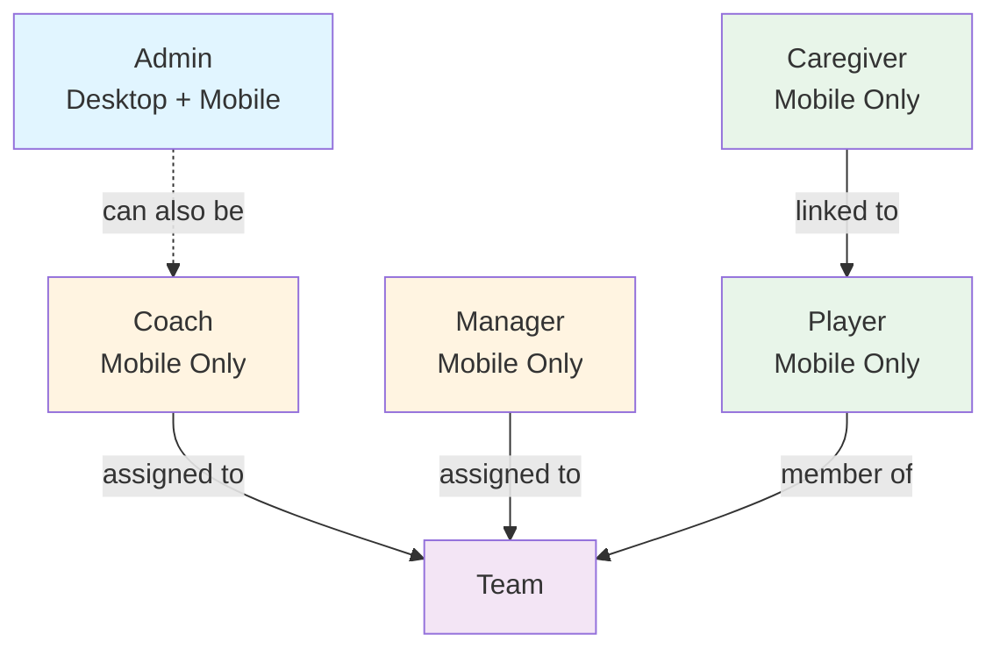
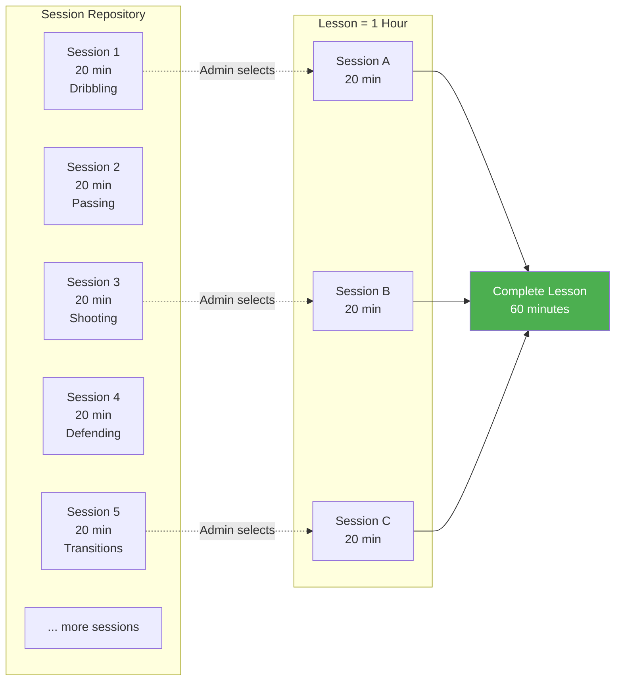
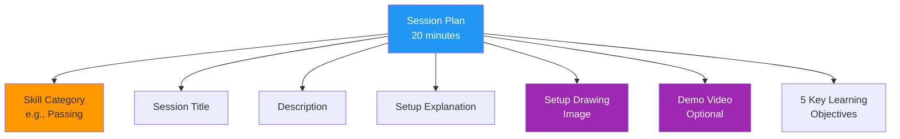
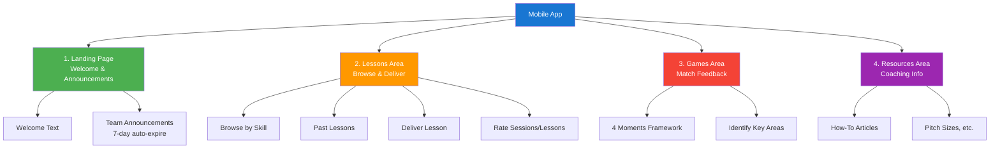
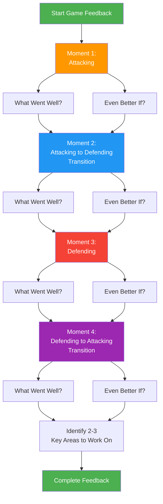
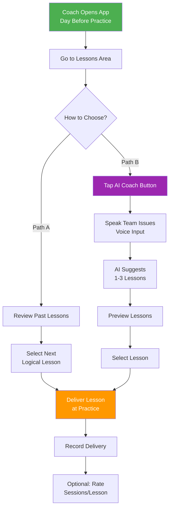
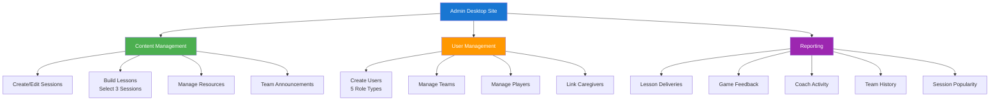
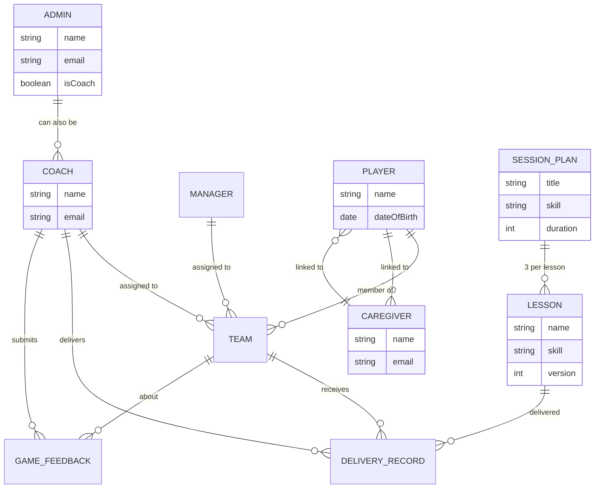

# West Coast Rangers Coaching App - Visual Diagrams

## 1. User Roles and Relationships

## 2. Session and Lesson Structure

## 3. Session Plan Components

## 4. Mobile App Structure (4 Main Areas)

## 5. Game Feedback - 4 Moments of Football

## 6. Coach Workflow - Selecting a Lesson

## 7. Admin Desktop Site Functions

## 8. Data Relationships

---

## How to Use These Diagrams

1. **View in Markdown Preview**: Open this file in a markdown viewer that supports Mermaid diagrams
2. **Copy to Presentation**: Copy individual diagrams into PowerPoint, Google Slides, or other presentation tools
3. **Online Rendering**: Use https://mermaid.live to render and export as PNG/SVG
4. **Print**: Print this document for reference during your meeting

## Key Points to Emphasize

### Session & Lesson Structure
- **Reusable Building Blocks**: Sessions are 20-minute activities stored in a repository
- **Flexible Composition**: Admins build 1-hour lessons by selecting any 3 sessions
- **Easy Updates**: Change a session once, updates everywhere it's used

### 4 Moments Framework
- **Structured Analysis**: Coaches analyze games systematically
- **Actionable Insights**: WWW/EBI format provides clear feedback
- **AI-Ready**: Structured data enables future AI recommendations

### User Roles
- **Clear Separation**: Each role has specific permissions and access
- **Flexible Relationships**: Many-to-many supports real-world scenarios
- **Family Engagement**: Players and caregivers included from Version 1
