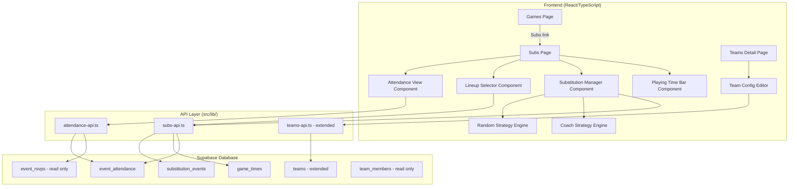

# Design Document: Game Day Subs

## Overview

The Game Day Subs feature extends the West Coast Rangers Football Coaching App with four capabilities:

1. **Actual Attendance Tracking** — A new `event_attendance` table and UI for recording who actually showed up to any event (game, training, general), separate from RSVP data. Supports guest players via free-text name entry.
2. **Team Configuration** — New `game_players` and `half_duration` columns on the `teams` table, editable from the desktop Teams detail page.
3. **Subs Page** — A new mobile page (`/games/:eventId/subs`) accessed from game cards, showing the game day squad, starting lineup selection, and substitution management.
4. **Substitution Engine** — Two strategies (Random equal-time rotation and Coach manual) for managing player swaps, with real-time playing time bars and full substitution history recording.

The feature builds on the existing events/RSVP system and follows established patterns: Supabase tables with RLS, ApiClient-based services, React pages with react-router navigation, and the project's brand colour/styling conventions.

## Architecture



The architecture separates concerns into three API services:
- `attendance-api.ts` — CRUD for event attendance records (used across all event types)
- `subs-api.ts` — Game-specific operations: game times, substitution events, squad/lineup queries
- `teams-api.ts` — Extended with game_players/half_duration update methods

The Random Strategy rotation calculation is a pure function in a dedicated utility module (`src/lib/rotation-engine.ts`), making it independently testable without database or UI dependencies.

## Components and Interfaces

### New Pages

**SubsPage** (`src/pages/SubsPage.tsx`)
- Route: `/games/:eventId/subs`
- Receives `eventId` from URL params
- Loads game context (event details, team config, attendance, RSVPs)
- Orchestrates child components: AttendanceView, LineupSelector, SubstitutionManager, PlayingTimeBar
- Brand colour: Orange `#ea7800` (same as Games page)
- Includes `pb-20` for mobile nav clearance

### New Components

**AttendanceView** (`src/components/subs/AttendanceView.tsx`)
- Displays players grouped by RSVP status: going → maybe → not_going → no_response
- "Going" players default to present; others default to absent
- Toggle buttons: "No" for present players, "Yes" for absent players
- Guest player text input at the bottom
- Reusable for all event types (not game-specific)

**LineupSelector** (`src/components/subs/LineupSelector.tsx`)
- Checkbox list of present players (from attendance)
- Enforces max selection = team's `game_players` count
- Displays "X/Y selected" counter
- Prevents over-selection with inline message

**SubstitutionManager** (`src/components/subs/SubstitutionManager.tsx`)
- Strategy selector: "Random" / "Coach" toggle
- Kick-off time input and second half start time input
- Delegates to RandomStrategy or CoachStrategy sub-components
- Displays substitution history chronologically

**RandomStrategy** (`src/components/subs/RandomStrategy.tsx`)
- Shows calculated rotation windows with player swap suggestions
- Highlight current/next rotation window
- Confirm button to record each substitution event
- Recalculates when attendance changes

**CoachStrategy** (`src/components/subs/CoachStrategy.tsx`)
- Shows on-field players and bench players as two lists
- Coach selects one off, one on → records substitution event
- Auto-calculates game minute from kick-off/second-half times

**PlayingTimeBar** (`src/components/subs/PlayingTimeBar.tsx`)
- Green horizontal bar, width = % of total elapsed game time played
- Percentage label alongside (e.g. "75%")
- Updates in real-time via interval timer during active play
- Works in both strategy modes

### Team Config Extension

**TeamConfigEditor** (added to existing `TeamsManagement.tsx`)
- Two number inputs: `game_players` and `half_duration`
- Validation: both must be ≥ 1
- Saves to teams table via teams-api

### API Services

**AttendanceApi** (`src/lib/attendance-api.ts`)
```typescript
class AttendanceApi extends ApiClient {
  getEventAttendance(eventId: string): Promise<EventAttendance[]>
  upsertAttendance(eventId: string, userId: string | null, attended: boolean, guestName?: string): Promise<EventAttendance>
  addGuestPlayer(eventId: string, guestName: string): Promise<EventAttendance>
}
```

**SubsApi** (`src/lib/subs-api.ts`)
```typescript
class SubsApi extends ApiClient {
  getGameTime(eventId: string): Promise<GameTime | null>
  upsertGameTime(eventId: string, kickOffTime?: string, secondHalfStartTime?: string): Promise<GameTime>
  getSubstitutionEvents(eventId: string): Promise<SubstitutionEvent[]>
  recordSubstitution(sub: Omit<SubstitutionEvent, 'id' | 'recorded_at'>): Promise<SubstitutionEvent>
  getGameDaySquad(eventId: string): Promise<SquadMember[]>  // joins attendance + user data
}
```

### Rotation Engine

**RotationEngine** (`src/lib/rotation-engine.ts`)

A pure-function module with no database or UI dependencies:

```typescript
interface RotationInput {
  squadSize: number;        // total players in game day squad
  gamePlayers: number;      // on-field count from team config
  halfDuration: number;     // minutes per half
  startingLineup: string[]; // player IDs/names starting on field
  subs: string[];           // player IDs/names starting on bench
}

interface RotationWindow {
  minute: number;           // game minute within the half
  playersOff: string[];     // who comes off
  playersOn: string[];      // who goes on
}

interface RotationPlan {
  firstHalf: RotationWindow[];
  secondHalf: RotationWindow[];
  swapGroupSize: number;
}

function calculateSwapGroupSize(numSubs: number): number
function calculateRotationPlan(input: RotationInput): RotationPlan
```

**Swap Group Size Logic:**
- 0 subs → 0 (no swaps)
- 1 sub → 1
- 2 subs → 2
- N subs (N > 2) → largest even number ≤ N

**Rotation Window Distribution:**
Each half is divided into equal time segments. The number of rotation windows per half = ceil(squadSize / gamePlayers) - 1, ensuring every player gets roughly equal time. Players rotate through on-field positions in a round-robin fashion within each half independently.

## Data Models

### New Tables

**event_attendance**
| Column | Type | Constraints | Description |
|--------|------|-------------|-------------|
| id | uuid | PK, default gen_random_uuid() | |
| event_id | uuid | FK → events.id, NOT NULL | |
| user_id | uuid | FK → users.id, NULLABLE | NULL for guest players |
| guest_name | text | NULLABLE | Free-text name for guests |
| attended | boolean | NOT NULL, default true | |
| recorded_at | timestamptz | NOT NULL, default now() | |
| created_at | timestamptz | NOT NULL, default now() | |
| updated_at | timestamptz | NOT NULL, default now() | |
| created_by | uuid | FK → users.id | |
| updated_by | uuid | FK → users.id | |

Constraints:
- UNIQUE(event_id, user_id) WHERE user_id IS NOT NULL — one record per rostered player per event
- CHECK: either user_id IS NOT NULL OR guest_name IS NOT NULL — must identify someone

**game_times**
| Column | Type | Constraints | Description |
|--------|------|-------------|-------------|
| id | uuid | PK, default gen_random_uuid() | |
| event_id | uuid | FK → events.id, UNIQUE, NOT NULL | One record per game |
| kick_off_time | timestamptz | NULLABLE | Actual first half start |
| second_half_start_time | timestamptz | NULLABLE | Actual second half start |
| created_at | timestamptz | NOT NULL, default now() | |
| updated_at | timestamptz | NOT NULL, default now() | |
| created_by | uuid | FK → users.id | |
| updated_by | uuid | FK → users.id | |

**substitution_events**
| Column | Type | Constraints | Description |
|--------|------|-------------|-------------|
| id | uuid | PK, default gen_random_uuid() | |
| event_id | uuid | FK → events.id, NOT NULL | The game event |
| player_off_id | uuid | FK → users.id, NULLABLE | NULL if guest |
| player_off_guest_name | text | NULLABLE | Guest player coming off |
| player_on_id | uuid | FK → users.id, NULLABLE | NULL if guest |
| player_on_guest_name | text | NULLABLE | Guest player going on |
| game_minute | integer | NOT NULL | Minute of the game |
| half | integer | NOT NULL, CHECK(half IN (1,2)) | Which half |
| strategy_used | text | NOT NULL, CHECK(strategy_used IN ('random','coach')) | |
| recorded_at | timestamptz | NOT NULL, default now() | |
| created_at | timestamptz | NOT NULL, default now() | |
| updated_at | timestamptz | NOT NULL, default now() | |
| created_by | uuid | FK → users.id | |
| updated_by | uuid | FK → users.id | |

### Modified Tables

**teams** — add columns:
| Column | Type | Constraints | Description |
|--------|------|-------------|-------------|
| game_players | integer | NULLABLE, CHECK(game_players >= 1) | On-field player count |
| half_duration | integer | NULLABLE, CHECK(half_duration >= 1) | Minutes per half |

Both nullable so existing teams aren't broken. The Subs page requires both to be set before enabling substitution features.

**Default half_duration by age group:**

The migration will pre-populate `half_duration` for existing teams based on their `age_group`:

| Age Group | Half Duration (mins) |
|-----------|---------------------|
| U4, U5, U6 | 15 |
| U7, U8 | 20 |
| U9, U10 | 25 |
| U11, U12 | 30 |
| U13, U14 | 35 |
| U15, U16, U17, Senior | 45 |

A utility function `getDefaultHalfDuration(ageGroup: string): number` will be used by the Teams Detail Page to pre-populate the field when creating new teams or when the value hasn't been set. The coach can override this default at any time.

### New TypeScript Types

```typescript
// In src/types/database.ts

export interface EventAttendance {
  id: string;
  event_id: string;
  user_id: string | null;
  guest_name: string | null;
  attended: boolean;
  recorded_at: string;
  created_at: string;
  updated_at: string;
  created_by?: string;
  updated_by?: string;
}

export interface GameTime {
  id: string;
  event_id: string;
  kick_off_time: string | null;
  second_half_start_time: string | null;
  created_at: string;
  updated_at: string;
  created_by?: string;
  updated_by?: string;
}

export interface SubstitutionEvent {
  id: string;
  event_id: string;
  player_off_id: string | null;
  player_off_guest_name: string | null;
  player_on_id: string | null;
  player_on_guest_name: string | null;
  game_minute: number;
  half: 1 | 2;
  strategy_used: 'random' | 'coach';
  recorded_at: string;
  created_at: string;
  updated_at: string;
  created_by?: string;
  updated_by?: string;
}

// Extended Team interface
export interface Team {
  id: string;
  name: string;
  age_group: string;
  division?: string;
  training_ground: string;
  training_time: string;
  game_players?: number;
  half_duration?: number;
  created_at: string;
}

// Squad member (joined view for Subs page)
export interface SquadMember {
  id: string;                    // attendance record id
  user_id: string | null;
  guest_name: string | null;
  display_name: string;          // computed: first_name + last_name or guest_name
  attended: boolean;
  is_guest: boolean;
  rsvp_status?: 'going' | 'not_going' | 'maybe' | 'no_response';
}
```

### RLS Policies

All new tables follow the project standard:
- **event_attendance**: Coaches/managers of the event's target teams can read/write. Players can read their own records.
- **game_times**: Coaches/managers of the event's target teams can read/write.
- **substitution_events**: Coaches/managers of the event's target teams can read/write. Read-only for players.

### Migration

Single migration file: `supabase/migrations/031_game_day_subs.sql`

Creates all three new tables, adds columns to teams, and sets up RLS policies and indexes.

## Correctness Properties

*A property is a characteristic or behavior that should hold true across all valid executions of a system — essentially, a formal statement about what the system should do. Properties serve as the bridge between human-readable specifications and machine-verifiable correctness guarantees.*

### Property 1: Default attendance derivation from RSVP

*For any* player with an RSVP record for an event and no existing attendance record, the derived attendance status should equal `rsvp_status === 'going'`. Players with "going" RSVP default to present; all other statuses ("maybe", "not_going", "no_response") default to absent.

**Validates: Requirements 1.3, 1.4, 5.2**

### Property 2: Attendance upsert round-trip

*For any* event and player (rostered or guest), upserting an attendance record with a given `attended` value and then reading it back should return a record with that same `attended` value. Repeated upserts should always reflect the most recent value (idempotent update).

**Validates: Requirements 1.1, 1.5, 1.6, 1.7**

### Property 3: RSVP data immutability under attendance operations

*For any* attendance upsert operation on an event, the set of event_rsvps records for that event should remain identical before and after the operation. Attendance tracking never modifies RSVP data.

**Validates: Requirements 1.8**

### Property 4: RSVP grouping order

*For any* set of RSVP records for an event, the attendance view's grouping function should return players ordered by RSVP status in the sequence: going, maybe, not_going, no_response. Within each group, order is stable.

**Validates: Requirements 1.2**

### Property 5: Guest player structural invariant

*For any* guest player added to an event's attendance, the resulting attendance record should have `user_id = null`, `guest_name` set to a non-empty string, and `attended = true`. Guest players should appear in the game day squad, be selectable for the starting lineup, and participate in substitution calculations identically to rostered players.

**Validates: Requirements 2.2, 2.3, 2.4, 11.3**

### Property 6: Team config round-trip and validation

*For any* valid `game_players` (integer ≥ 1) and `half_duration` (integer ≥ 1) values, saving them to a team record and reading back should return the same values. *For any* integer less than 1, the validation function should reject the value for both `game_players` and `half_duration`.

**Validates: Requirements 3.1, 3.2, 3.4, 3.5, 3.6**

### Property 7: Game day squad derivation

*For any* game event with attendance records, the game day squad should contain exactly the set of players (rostered and guest) whose attendance record has `attended = true`. The squad count should equal the size of this set.

**Validates: Requirements 5.1, 5.3**

### Property 8: Starting lineup invariant

*For any* sequence of lineup check/uncheck operations on a game day squad with a team's `game_players` count of N, the starting lineup should never contain more than N players. The lineup should contain exactly the set of currently checked players, and any attempt to check a player when the lineup is already at capacity N should be rejected.

**Validates: Requirements 6.2, 6.3, 6.4, 6.5**

### Property 9: Game time round-trip

*For any* valid kick-off timestamp and second-half start timestamp, saving them to a game_times record and reading back should return the same values. The second_half_start_time should only be settable after kick_off_time is recorded.

**Validates: Requirements 7.2, 7.4**

### Property 10: Swap group size calculation

*For any* non-negative integer N representing the number of available substitutes, the swap group size should be: 0 if N=0, 1 if N=1, 2 if N=2, and for N>2 the largest even number ≤ N.

**Validates: Requirements 9.2**

### Property 11: Rotation engine equal-time distribution

*For any* valid rotation input (squad size > game_players, game_players ≥ 1, half_duration ≥ 1), the rotation plan should: (a) produce rotation windows for each half independently, (b) distribute windows evenly across each half's duration, and (c) result in every squad member's total calculated playing time being within one rotation window's duration of every other squad member's playing time (approximately equal).

**Validates: Requirements 9.1, 9.3, 9.6, 7.5, 7.7**

### Property 12: Game minute calculation

*For any* kick-off time (or second-half start time) and current time where current time ≥ reference time, the calculated game minute should equal `floor((currentTime - referenceTime) / 60000)`. For the second half, the game minute should be offset by the half_duration.

**Validates: Requirements 10.3**

### Property 13: Substitution state consistency

*For any* starting lineup and sequence of valid substitution events, the current on-field set should equal the starting lineup with all recorded swaps applied in order (each swap removes player_off and adds player_on). The bench set should be the complement of the on-field set within the game day squad.

**Validates: Requirements 10.1, 10.4, 9.5, 10.2, 11.1**

### Property 14: Playing time percentage calculation

*For any* player in the game day squad, given their list of on-field time intervals and the total elapsed game time (across both halves), the playing time percentage should equal `sum(interval_durations) / total_elapsed_time * 100`. A player who has been on the field for the entire game should show 100%. A player who has never been on the field should show 0%.

**Validates: Requirements 12.2**

## Error Handling

### Database Errors
- All API calls use the existing `ApiError` pattern from `api-client.ts`
- Failed attendance upserts show a toast notification and preserve the previous UI state
- Failed substitution event recording shows an error and does not update the on-field/bench lists
- Network errors during game time saves are retried once, then show an error toast

### Validation Errors
- Team config: inline validation messages for game_players < 1 or half_duration < 1, save button disabled
- Lineup selection: inline message "Lineup full (X/X)" when attempting to exceed game_players
- Guest player name: empty/whitespace-only names are rejected with inline feedback
- Kick-off time: must be a valid timestamp; Random strategy disabled until recorded

### Edge Cases
- Zero substitutes (squad size = game_players): rotation engine returns empty rotation plan, no swap UI shown
- Game with no RSVPs: empty attendance list, coach must add players manually or via guest entry
- Team without game_players/half_duration configured: Subs page shows a message directing coach to configure team settings on desktop
- Second half start time before first half end: allowed (ref may have shortened first half), no validation error
- Guest player with same name as rostered player: allowed, distinguished by user_id presence

### State Recovery
- All game state (attendance, game times, substitution events) is persisted to Supabase immediately
- Refreshing the Subs page reloads all state from the database
- No local-only state that could be lost on page refresh

## Testing Strategy

### Property-Based Testing

Use `fast-check` as the property-based testing library for TypeScript.

Each correctness property maps to a single property-based test with minimum 100 iterations. Tests target the pure functions and logic modules:

- **Rotation Engine** (`rotation-engine.ts`): Properties 10, 11 — swap group size calculation and equal-time distribution
- **Attendance Derivation** (utility function): Properties 1, 4 — default status from RSVP, grouping order
- **Lineup Logic** (utility function): Property 8 — max selection enforcement
- **Game Minute Calculation** (utility function): Property 12 — time difference calculation
- **Playing Time Calculation** (utility function): Property 14 — percentage from intervals
- **Substitution State** (utility function): Property 13 — on-field/bench set after swaps

Each test must be tagged with a comment:
```typescript
// Feature: game-day-subs, Property 10: Swap group size calculation
```

Configuration: `fc.assert(fc.property(...), { numRuns: 100 })`

### Unit Testing

Unit tests (using Vitest) cover specific examples, edge cases, and integration points:

- Attendance API: upsert creates new record, upsert updates existing record, guest player creation
- Team config API: save and load, validation rejection
- Game times API: save kick-off, save second half start
- Substitution events API: record and retrieve, guest player substitutions
- Subs page component: renders game context header, shows attendance list, lineup counter display
- Edge cases: zero subs scenario, no RSVPs, unconfigured team, empty guest name rejection

### Test File Locations

- `src/lib/__tests__/rotation-engine.test.ts` — property tests for rotation engine
- `src/lib/__tests__/attendance-logic.test.ts` — property tests for attendance derivation
- `src/lib/__tests__/game-minute.test.ts` — property tests for time calculations
- `src/lib/__tests__/lineup-logic.test.ts` — property tests for lineup selection
- `src/lib/__tests__/playing-time.test.ts` — property tests for playing time calculation
- `src/lib/__tests__/substitution-state.test.ts` — property tests for sub state tracking
- `src/lib/__tests__/attendance-api.test.ts` — unit tests for attendance API
- `src/lib/__tests__/subs-api.test.ts` — unit tests for subs API
- `src/components/subs/__tests__/` — component unit tests
