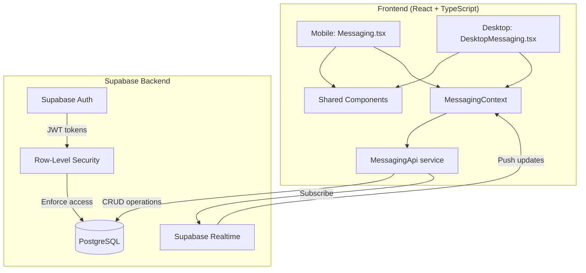
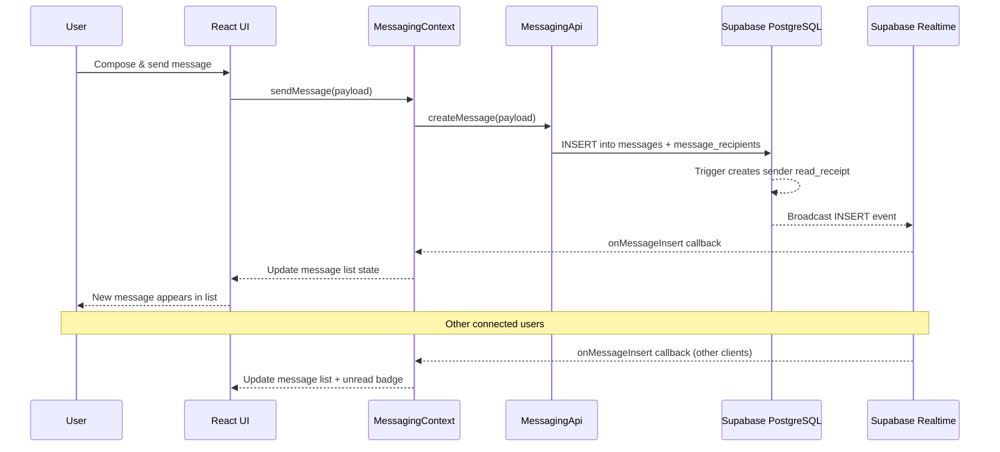

# Design Document: Team Messaging

## Overview

This design replaces the placeholder mock data in the mobile `Messaging.tsx` and desktop `DesktopMessaging.tsx` pages with a fully functional real-time messaging system. The system is built on Supabase (PostgreSQL + Realtime) and supports team-scoped messaging with threading, read tracking, emoji reactions, archiving, search, and event reminders.

The messaging system follows the existing app patterns: an `ApiClient`-based service layer, TypeScript interfaces in `database.ts`, React context for shared state, and Supabase Realtime for live updates. Messages are scoped by team membership and targeting type (individual, whole_team, management_team, club_admin), with row-level security enforcing access control at the database level.

### Key Design Decisions

1. **Per-user archiving via a junction table** rather than a timestamp on the message itself — allows each user to independently archive/unarchive threads without affecting other recipients.
2. **Denormalized `recipient_user_ids` array on `message_recipients`** — avoids expensive joins at read time while the targeting type preserves the original intent for display purposes.
3. **Supabase Realtime subscriptions with polling fallback** — primary delivery via Realtime channels, with 30-second polling as a resilience mechanism.
4. **Shared component library** between mobile and desktop — the same `MessageCard`, `ComposeForm`, `ReplyForm`, `ReadDetailModal`, and `ReactionPicker` components are used on both platforms, with layout wrappers handling responsive differences.
5. **Database trigger for sender auto-read** — a PostgreSQL trigger automatically creates a read receipt for the sender when a message is inserted, keeping this logic out of the application layer.

## Architecture



### Data Flow



## Components and Interfaces

### Database Migration

**File:** `supabase/migrations/033_team_messaging.sql`

Creates the following tables, triggers, indexes, and RLS policies in a single migration.

### API Service Layer

**File:** `src/lib/messaging-api.ts`

```typescript
class MessagingApi extends ApiClient {
  // Messages
  getThreads(userId: string, teamIds: string[]): Promise<Thread[]>
  getThreadDetail(messageId: string): Promise<ThreadDetail>
  createMessage(payload: CreateMessagePayload): Promise<Message>
  createReply(parentId: string, payload: CreateReplyPayload): Promise<Message>
  searchMessages(query: string, userId: string): Promise<SearchResult[]>

  // Read receipts
  markAsRead(messageId: string, userId: string): Promise<void>
  getReadReceipts(messageId: string): Promise<ReadReceipt[]>
  getUnreadCount(userId: string): Promise<number>

  // Reactions
  toggleReaction(messageId: string, userId: string, emoji: string): Promise<void>
  getReactions(messageId: string): Promise<ReactionGroup[]>

  // Archiving
  archiveThread(messageId: string, userId: string): Promise<void>
  unarchiveThread(messageId: string, userId: string): Promise<void>
  getArchivedThreads(userId: string): Promise<Thread[]>

  // Realtime
  subscribeToMessages(teamIds: string[], callback: (msg: Message) => void): RealtimeChannel
  subscribeToReadReceipts(messageIds: string[], callback: (receipt: ReadReceipt) => void): RealtimeChannel
  subscribeToReactions(messageIds: string[], callback: (reaction: Reaction) => void): RealtimeChannel

  // Recipient resolution
  resolveRecipients(targetType: TargetingType, teamId: string, individualUserId?: string): Promise<string[]>
}
```

### React Context

**File:** `src/contexts/MessagingContext.tsx`

Provides shared messaging state to both mobile and desktop layouts:

- `threads`: active thread list, sorted by last activity
- `archivedThreads`: archived thread list
- `unreadCount`: total unread messages for the current user
- `selectedThread`: currently viewed thread detail (desktop two-panel, mobile drill-in)
- `sendMessage()`, `sendReply()`, `markAsRead()`, `toggleReaction()`, `archiveThread()`, `unarchiveThread()`
- Manages Supabase Realtime subscriptions lifecycle (subscribe on mount, unsubscribe on unmount)
- Implements polling fallback when Realtime connection drops

### UI Components

All shared components live in `src/components/messaging/`:

| Component | Description |
|---|---|
| `MessageCard` | Renders a single message: title (bold if unread), truncated body, sender name, date, type icon (User/Users), read count indicator, reaction chips |
| `ThreadView` | Renders a top-level message + indented replies, with ReplyForm at the bottom |
| `ComposeForm` | New message form: targeting type selector, team selector (if multi-team), individual user search, title input, body textarea |
| `ReplyForm` | Reply composer: body textarea only (title inherited from parent), pre-populated recipient display |
| `ReadDetailModal` | Modal listing all recipients with green highlight for readers, sorted readers-first |
| `ReactionPicker` | Emoji picker popover with standard emoji set, toggle behaviour |
| `SearchBar` | Search input with debounced filtering |
| `UnreadBadge` | Numeric badge overlay for the Messages nav tab |
| `ArchiveToggle` | Swipe-to-archive (mobile) / context menu archive (desktop) |

### Page Components

| Page | File | Layout |
|---|---|---|
| Mobile Messages | `src/pages/Messaging.tsx` | Single-column list → drill into ThreadView |
| Desktop Messages | `src/pages/desktop/DesktopMessaging.tsx` | Two-panel: thread list (left) + thread detail (right) |

### Event Reminder Integration

The "Send Reminder" button is added to the existing Schedule event card components. When tapped, it opens the `ComposeForm` pre-filled with event details (title, date, location, RSVP prompt) and the recipient set resolved from the event's `target_teams`.

## Data Models

### New Database Tables

#### `messages`

| Column | Type | Constraints | Description |
|---|---|---|---|
| `id` | `uuid` | PK, default `gen_random_uuid()` | Unique message identifier |
| `sender_id` | `uuid` | FK → `users(id)`, NOT NULL | User who sent the message |
| `team_id` | `uuid` | FK → `teams(id)`, NOT NULL | Team context for the message |
| `parent_message_id` | `uuid` | FK → `messages(id)`, NULL | NULL for top-level, references parent for replies |
| `title` | `text` | NOT NULL | Message subject line |
| `body` | `text` | NOT NULL | Message content |
| `created_at` | `timestamptz` | default `now()` | When the message was created |

Per-user archiving is handled by the `message_archives` junction table (not a column on this table).

#### `message_recipients`

| Column | Type | Constraints | Description |
|---|---|---|---|
| `id` | `uuid` | PK, default `gen_random_uuid()` | Unique record ID |
| `message_id` | `uuid` | FK → `messages(id)` ON DELETE CASCADE, NOT NULL | The message |
| `targeting_type` | `text` | NOT NULL, CHECK IN ('individual', 'whole_team', 'management_team', 'club_admin') | How recipients were selected |
| `recipient_user_ids` | `uuid[]` | NOT NULL | Resolved array of recipient user IDs |
| `notification_pending` | `boolean` | default `true` | Flag for future push notification delivery |

#### `message_read_receipts`

| Column | Type | Constraints | Description |
|---|---|---|---|
| `id` | `uuid` | PK, default `gen_random_uuid()` | Unique record ID |
| `message_id` | `uuid` | FK → `messages(id)` ON DELETE CASCADE, NOT NULL | The message that was read |
| `user_id` | `uuid` | FK → `users(id)`, NOT NULL | The user who read it |
| `read_at` | `timestamptz` | default `now()` | When the message was first viewed |
| | | UNIQUE(`message_id`, `user_id`) | Prevent duplicate read receipts |

#### `message_reactions`

| Column | Type | Constraints | Description |
|---|---|---|---|
| `id` | `uuid` | PK, default `gen_random_uuid()` | Unique record ID |
| `message_id` | `uuid` | FK → `messages(id)` ON DELETE CASCADE, NOT NULL | The message reacted to |
| `user_id` | `uuid` | FK → `users(id)`, NOT NULL | The user who reacted |
| `emoji` | `text` | NOT NULL | The emoji character |
| `created_at` | `timestamptz` | default `now()` | When the reaction was added |
| | | UNIQUE(`message_id`, `user_id`, `emoji`) | One reaction per emoji per user per message |

#### `message_archives`

| Column | Type | Constraints | Description |
|---|---|---|---|
| `id` | `uuid` | PK, default `gen_random_uuid()` | Unique record ID |
| `message_id` | `uuid` | FK → `messages(id)` ON DELETE CASCADE, NOT NULL | The top-level message archived |
| `user_id` | `uuid` | FK → `users(id)`, NOT NULL | The user who archived it |
| `archived_at` | `timestamptz` | default `now()` | When it was archived |
| | | UNIQUE(`message_id`, `user_id`) | One archive record per user per message |

#### `device_tokens`

| Column | Type | Constraints | Description |
|---|---|---|---|
| `id` | `uuid` | PK, default `gen_random_uuid()` | Unique record ID |
| `user_id` | `uuid` | FK → `users(id)`, NOT NULL | The user |
| `device_token` | `text` | NOT NULL | The push notification token |
| `platform` | `text` | NOT NULL, CHECK IN ('web', 'android', 'ios') | Device platform |
| `created_at` | `timestamptz` | default `now()` | When the token was registered |
| | | UNIQUE(`user_id`, `device_token`) | Prevent duplicate tokens |

### Database Trigger

**`trigger_sender_auto_read`**: After INSERT on `messages`, automatically inserts a `message_read_receipts` row for the `sender_id` with `read_at = now()`.

### Indexes

- `messages(parent_message_id)` — fast thread lookups
- `messages(team_id, created_at DESC)` — team message listing
- `messages(sender_id)` — sender's message history
- `message_recipients(message_id)` — recipient lookup by message
- `message_read_receipts(message_id)` — read count aggregation
- `message_read_receipts(user_id)` — unread count for a user
- `message_reactions(message_id)` — reaction display
- `message_archives(user_id)` — archived thread listing
- GIN index on `message_recipients(recipient_user_ids)` — fast array containment queries for RLS

### TypeScript Interfaces

Added to `src/types/database.ts`:

```typescript
// Messaging targeting types
export type MessageTargetingType = 'individual' | 'whole_team' | 'management_team' | 'club_admin';

// Message model
export interface Message {
  id: string;
  sender_id: string;
  team_id: string;
  parent_message_id: string | null;
  title: string;
  body: string;
  created_at: string;
}

// Message recipient record
export interface MessageRecipient {
  id: string;
  message_id: string;
  targeting_type: MessageTargetingType;
  recipient_user_ids: string[];
  notification_pending: boolean;
}

// Read receipt
export interface MessageReadReceipt {
  id: string;
  message_id: string;
  user_id: string;
  read_at: string;
}

// Reaction
export interface MessageReaction {
  id: string;
  message_id: string;
  user_id: string;
  emoji: string;
  created_at: string;
}

// Archive record
export interface MessageArchive {
  id: string;
  message_id: string;
  user_id: string;
  archived_at: string;
}

// Device token for future push notifications
export interface DeviceToken {
  id: string;
  user_id: string;
  device_token: string;
  platform: 'web' | 'android' | 'ios';
  created_at: string;
}

// Composed view types for UI
export interface Thread {
  message: Message;
  sender: { first_name: string; last_name: string };
  recipient: MessageRecipient;
  reply_count: number;
  last_activity: string;
  read_count: number;
  total_recipients: number;
  is_read: boolean;
  is_archived: boolean;
  reactions: ReactionGroup[];
}

export interface ThreadDetail {
  thread: Thread;
  replies: (Message & { sender: { first_name: string; last_name: string }; reactions: ReactionGroup[] })[];
}

export interface ReactionGroup {
  emoji: string;
  count: number;
  user_ids: string[];
}

export interface CreateMessagePayload {
  team_id: string;
  targeting_type: MessageTargetingType;
  title: string;
  body: string;
  individual_user_id?: string;
}

export interface CreateReplyPayload {
  body: string;
}

export interface SearchResult {
  thread: Thread;
  match_context: string;
  is_archived: boolean;
}
```

### Row-Level Security Policies

**messages table:**
- SELECT: User can read if `sender_id = auth.uid()` OR user's ID is in the associated `message_recipients.recipient_user_ids` array, OR user has admin role
- INSERT: User can insert if they are a member of the target `team_id` (checked via `team_members` or `user_teams`)

**message_read_receipts table:**
- INSERT: User can only insert where `user_id = auth.uid()`
- SELECT: User can read receipts for messages they can access (same visibility as messages)

**message_reactions table:**
- INSERT/DELETE: User can manage reactions where `user_id = auth.uid()` AND user is in the message's recipient set or is the sender
- SELECT: Same visibility as the parent message

**message_archives table:**
- ALL: User can only manage their own archive records (`user_id = auth.uid()`)

**device_tokens table:**
- ALL: User can only manage their own tokens (`user_id = auth.uid()`)


## Correctness Properties

*A property is a characteristic or behavior that should hold true across all valid executions of a system — essentially, a formal statement about what the system should do. Properties serve as the bridge between human-readable specifications and machine-verifiable correctness guarantees.*

### Property 1: Message creation stores all required fields

*For any* valid message payload (with sender, team, title, body, and optional parent_message_id), creating a message should produce a stored record containing all specified fields, and a corresponding `message_recipients` record with the correct targeting type and resolved user IDs.

**Validates: Requirements 1.1, 1.2, 3.7**

### Property 2: Sender auto-read receipt

*For any* newly created message, a `message_read_receipts` record should automatically exist for the sender with a `read_at` timestamp equal to or after the message's `created_at`.

**Validates: Requirements 1.6, 7.3**

### Property 3: Foreign key integrity rejects invalid references

*For any* insert into `messages`, `message_read_receipts`, `message_reactions`, or `message_recipients` with a non-existent foreign key value, the database should reject the operation.

**Validates: Requirements 1.7**

### Property 4: Message visibility restricted to recipients and sender

*For any* user and any message, the user can read the message if and only if the user is the sender, the user's ID is in the `recipient_user_ids` array, or the user has the admin role.

**Validates: Requirements 2.1, 2.4, 13.3**

### Property 5: Message creation restricted to team members

*For any* authenticated user and any team, the user can create a message targeting that team if and only if the user is a member of that team (via `team_members` or `user_teams`).

**Validates: Requirements 2.2**

### Property 6: Read receipt self-only constraint

*For any* read receipt insert attempt, the operation succeeds only if the `user_id` matches the authenticated user's ID.

**Validates: Requirements 2.3**

### Property 7: Reaction authorization

*For any* user and any message, the user can add or remove a reaction if and only if the user is in the message's `recipient_user_ids` array or is the message sender.

**Validates: Requirements 2.5, 9.5**

### Property 8: Recipient resolution correctness

*For any* team, resolving recipients by targeting type should produce:
- `whole_team`: all players, caregivers, managers, and coaches in the team
- `management_team`: only coaches and managers in the team
- `club_admin`: all users with the admin role
- `individual`: exactly the specified user

**Validates: Requirements 3.3, 3.4, 3.5**

### Property 9: Compose form validation rejects empty input

*For any* string composed entirely of whitespace (or empty string) used as a title or body, the compose/reply form should reject submission and the message list should remain unchanged.

**Validates: Requirements 3.6, 6.5, 15.4**

### Property 10: Active message list completeness

*For any* user, the active message list should contain exactly the set of top-level threads where the user is in the recipient set or is the sender, excluding threads the user has archived.

**Validates: Requirements 4.1, 12.3**

### Property 11: Thread ordering by last activity

*For any* list of threads returned by the message list query, the threads should be sorted in descending order by their last activity timestamp (most recent first).

**Validates: Requirements 4.2**

### Property 12: Caregiver message visibility

*For any* caregiver user with linked players via `player_caregivers`, the message list should include messages from teams where those linked players are members.

**Validates: Requirements 4.4**

### Property 13: Message card content completeness

*For any* message, the rendered `MessageCard` should contain the message title, body (or truncated body), sender's full name, and formatted date.

**Validates: Requirements 5.1**

### Property 14: Read status determines display style

*For any* message and any user, the message title should render in bold if and only if the user does not have a read receipt for that message.

**Validates: Requirements 5.3, 5.4**

### Property 15: Message type icon correctness

*For any* message, the type icon should be a single-person icon when `targeting_type` is `individual`, and a group icon otherwise.

**Validates: Requirements 5.2**

### Property 16: Reply stores parent reference

*For any* reply to a top-level message, the stored reply should have `parent_message_id` set to the top-level message's ID (not to another reply's ID).

**Validates: Requirements 6.3**

### Property 17: Reply updates thread last activity

*For any* thread, when a new reply is added, the thread's last activity timestamp should be updated to the reply's `created_at`, making it the most recent thread if no other thread has newer activity.

**Validates: Requirements 6.4**

### Property 18: Reply form inherits recipient set

*For any* reply action on a message, the reply form's recipient set should match the parent message's `recipient_user_ids`.

**Validates: Requirements 6.2**

### Property 19: Read receipt creation on view

*For any* user opening a message they have not previously read, a new `message_read_receipts` record should be created with the current timestamp.

**Validates: Requirements 7.1**

### Property 20: Read count indicator accuracy

*For any* top-level message, the read count indicator should display "X/Y" where X equals the count of `message_read_receipts` for that message and Y equals the length of `recipient_user_ids`.

**Validates: Requirements 7.2**

### Property 21: Read detail modal ordering

*For any* message's read detail modal, recipients with read receipts should appear before recipients without read receipts.

**Validates: Requirements 7.5, 7.6**

### Property 22: Unread badge accuracy

*For any* user, the unread badge should display the count of messages where the user is in the recipient set and has no read receipt. The badge should be visible when count > 0 and hidden when count = 0.

**Validates: Requirements 8.1, 8.2, 8.3**

### Property 23: Reading a message decrements unread count

*For any* user with N unread messages, after reading one message, the unread count should be N - 1.

**Validates: Requirements 8.5**

### Property 24: Reaction toggle is idempotent round-trip

*For any* user, message, and emoji, adding a reaction then toggling the same reaction should result in no reaction existing. Adding it again should restore it. The operation `toggle(toggle(state))` should equal the original state.

**Validates: Requirements 9.4**

### Property 25: Reaction grouping correctness

*For any* set of reactions on a message, the grouped display should show each unique emoji exactly once with a count equal to the number of distinct users who reacted with that emoji.

**Validates: Requirements 9.3**

### Property 26: Event reminder pre-fill correctness

*For any* event, the pre-filled reminder message should contain the event's title, date, and location in the body text.

**Validates: Requirements 11.2**

### Property 27: Event reminder recipient resolution

*For any* event with target teams, the reminder's recipient set should resolve to all users associated with those teams (players, caregivers, coaches, managers).

**Validates: Requirements 11.3**

### Property 28: Archive round-trip

*For any* user and any active thread, archiving then unarchiving should restore the thread to the active message list in its correct position by last activity.

**Validates: Requirements 12.2, 12.5**

### Property 29: Reply auto-unarchives thread

*For any* archived thread, when a new reply is added, all `message_archives` records for that thread should be deleted, restoring the thread to the active list for all users who had archived it.

**Validates: Requirements 12.6**

### Property 30: Search returns matching results across active and archived

*For any* search query string and any set of messages, the search results should contain only threads where the title, body, or sender name contains the query text, and results should include both active and archived messages with their status clearly indicated.

**Validates: Requirements 14.2, 14.3**

### Property 31: Read receipt retry logic

*For any* read receipt persistence failure, the system should retry up to 3 times before surfacing an error.

**Validates: Requirements 15.3**

### Property 32: Notification pending flag defaults to true

*For any* newly created message recipient record, the `notification_pending` field should default to `true`.

**Validates: Requirements 16.2**

### Property 33: Multiple device tokens per user

*For any* user, inserting multiple device tokens with distinct `device_token` values should succeed, and querying by `user_id` should return all registered tokens.

**Validates: Requirements 16.4**

## Error Handling

### Network Errors (Message Send)

When `MessagingApi.createMessage()` throws due to a network error:
1. The `ComposeForm` retains all user input (title, body, targeting selection)
2. An inline error toast is displayed below the send button: "Message failed to send. Check your connection and try again."
3. The send button re-enables for retry

### Realtime Connection Loss

The `MessagingContext` monitors the Supabase Realtime channel status:
1. On `CHANNEL_ERROR` or `TIMED_OUT`, start a 30-second polling interval using `setInterval`
2. On each poll, call `MessagingApi.getThreads()` to fetch latest messages
3. Continue attempting Realtime reconnection in the background
4. When Realtime reconnects (`SUBSCRIBED` status), stop polling and resume Realtime-only delivery

### Read Receipt Failures

`MessagingApi.markAsRead()` implements retry logic:
1. On failure, retry up to 3 times with exponential backoff (1s, 2s, 4s)
2. If all retries fail, log the error and display a subtle toast: "Could not mark message as read"
3. The UI optimistically marks the message as read immediately; if all retries fail, revert the visual state

### Validation Errors

The `ComposeForm` and `ReplyForm` perform client-side validation:
- Empty or whitespace-only title → inline error: "Title is required"
- Empty or whitespace-only body → inline error: "Message body is required"
- No targeting type selected → inline error: "Please select recipients"
- Submit button is disabled until all validation passes

### Database Constraint Violations

If a unique constraint violation occurs (e.g., duplicate read receipt, duplicate reaction):
- Read receipts: silently ignore (idempotent operation)
- Reactions: treat as a toggle — delete the existing reaction instead

## Testing Strategy

### Property-Based Testing

**Library:** [fast-check](https://github.com/dubzzz/fast-check) for TypeScript property-based testing.

**Configuration:** Each property test runs a minimum of 100 iterations.

**Tag format:** Each test includes a comment: `// Feature: team-messaging, Property {N}: {title}`

Each correctness property from the design document maps to a single property-based test. The test generates random valid inputs (messages, users, teams, targeting types) and verifies the property holds across all generated cases.

Key property test areas:
- Recipient resolution (Property 8): Generate random teams with random members of various roles, verify resolution produces the correct subset for each targeting type
- Message visibility / RLS (Property 4): Generate random users and messages, verify access is correctly granted/denied based on recipient set membership
- Thread ordering (Property 11): Generate random threads with random timestamps, verify sort order
- Read count accuracy (Property 20): Generate random read receipt sets, verify X/Y calculation
- Reaction toggle idempotence (Property 24): Generate random toggle sequences, verify final state matches expected
- Archive round-trip (Property 28): Generate random archive/unarchive sequences, verify final visibility
- Search correctness (Property 30): Generate random messages and search queries, verify result set contains only matches
- Validation rejection (Property 9): Generate random whitespace strings, verify all are rejected

### Unit Testing

Unit tests complement property tests by covering specific examples, edge cases, and integration points:

- Sender auto-read trigger fires correctly (specific example for Property 2)
- Caregiver visibility with multiple linked players across different teams (edge case for Property 12)
- Event reminder pre-fill with special characters in event title (edge case for Property 26)
- Reply to a reply stores the top-level parent ID, not the intermediate reply ID (edge case for Property 16)
- Unread badge shows 0 and hides when all messages are read (edge case for Property 22)
- Read receipt retry exhaustion after 3 failures (edge case for Property 31)
- Compose form displays all four targeting options (example for Requirement 3.1)
- Desktop two-panel layout renders thread list and detail (example for Requirement 13.2)
- Search field clear returns to default active view (example for Requirement 14.4)

### Integration Testing

Integration tests verify end-to-end flows through the Supabase backend:

- Full message lifecycle: compose → send → receive via Realtime → read → react → archive → unarchive
- RLS policy enforcement: verify unauthorized users cannot read/write messages outside their teams
- Event reminder flow: create event → send reminder → verify message appears for all target team members
- Multi-team user: verify compose form shows team selector and messages from all teams appear in list
