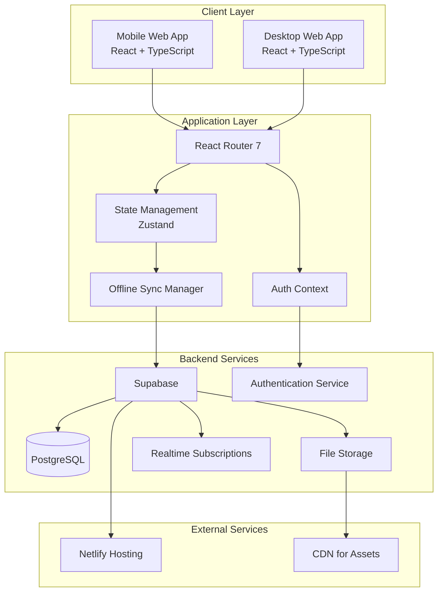
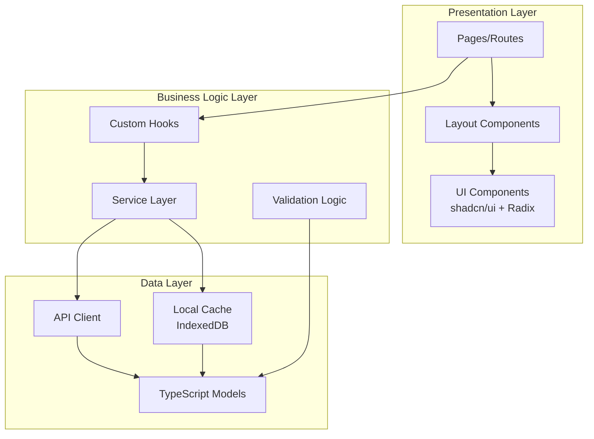
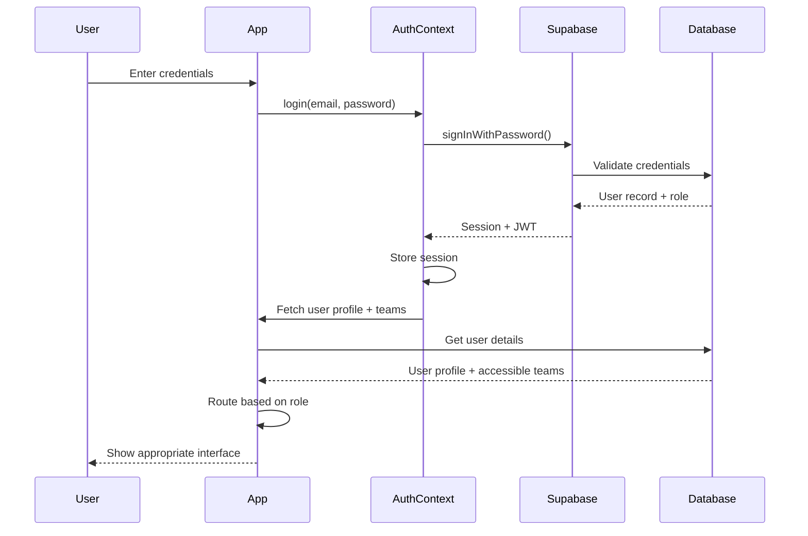
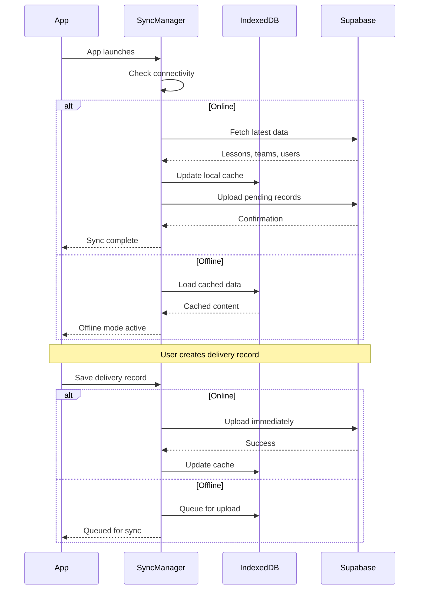
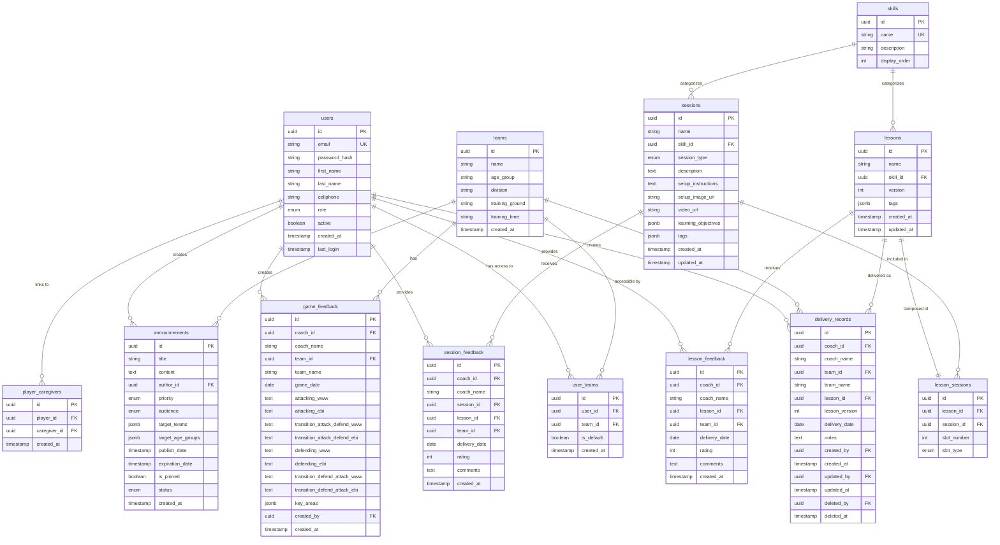

# Design Document: Technical Foundation

## Overview

This document establishes the technical foundation for the football coaching app, a role-based coaching management platform for West Coast Rangers FC. The system supports 200+ users across 5 roles (Player, Caregiver, Coach, Manager, Admin) with mobile and desktop responsive interfaces. The foundation prioritizes offline capability, role-based access control, secure authentication, and data synchronization while maintaining a scalable architecture for future enhancements.

The design focuses on establishing core infrastructure components that support Version 1.0 trial scope (10 weeks, <20 teams) while architecting for future growth including AI features, event management, and external system integrations.

## Architecture

### High-Level System Architecture



### Component Architecture



### Authentication Flow



### Data Synchronization Flow



## Database Architecture

### Entity Relationship Diagram



### Database Schema Details

#### Core Tables

**users**: Central user management with role-based access
- Supports 5 roles: player, caregiver, coach, manager, admin
- Password hashing via Supabase Auth
- Tracks last login for activity monitoring

**teams**: Team organization and metadata
- Age group categorization (U8, U9, U10, U11, U12)
- Training location and schedule information
- Foundation for team-based access control

**user_teams**: Many-to-many relationship between users and teams
- Supports coaches/managers assigned to multiple teams
- Default team designation for pre-population
- Players and caregivers linked to their teams

**skills**: Skill categories for organizing content
- Initial categories: Passing and First Touch, Dribbling and Ball Control, Shooting, Defending, Attacking, Transitions
- Display order for consistent UI presentation
- Used by both sessions and lessons

**sessions**: 20-minute training activities (repository)
- Session types: Technical Drill, Skill Introduction, Skill Development, Game
- Rich content: description, setup instructions, media
- Tag-based categorization for filtering
- Learning objectives stored as JSON array

**lessons**: Complete training programs (4 sessions)
- Version tracking for content updates
- Skill-based categorization
- Tag-based filtering (age group, technical level, fun level)
- Composed of exactly 4 sessions via lesson_sessions

**lesson_sessions**: Junction table linking lessons to sessions
- Enforces 4-slot structure
- Slot types: warmup_technical, skill_introduction, progressive_development, game_application
- Maintains session order within lesson


#### Activity Tracking Tables

**delivery_records**: Tracks lesson deliveries by coaches
- Captures coach and team names as text snapshots (denormalized for historical accuracy)
- Lesson version tracking for content change history
- Full audit trail: created_by, updated_by, deleted_by with timestamps
- Soft delete support (deleted_at field)
- Optional delivery notes

**session_feedback**: Individual session ratings
- 0-5 rating scale
- Optional comments
- Links to specific session, lesson, and delivery context
- Coach attribution for feedback analysis

**lesson_feedback**: Complete lesson ratings
- 0-5 rating scale
- Optional comments
- Aggregated view of lesson effectiveness
- Supports admin reporting and content improvement

**game_feedback**: Post-match analysis using 4 Moments framework
- Structured WWW (What Went Well) and EBI (Even Better If) for each moment
- Four moments: Attacking, Attacking→Defending, Defending, Defending→Attacking
- Key areas for improvement stored as JSON array
- Links to team and coach for reporting

**announcements**: Team and general announcements
- Rich text content support
- Priority levels (high, normal)
- Audience targeting (all, coaches, managers, players, caregivers)
- Team and age group targeting via JSON arrays
- Auto-expiration after 7 days
- Pin functionality for important announcements
- Draft/published status workflow

**player_caregivers**: Links players to their caregivers
- Supports multiple caregivers per player
- Supports multiple players per caregiver
- Foundation for family communication features


### Row-Level Security (RLS) Policies

Supabase RLS policies enforce role-based access control at the database level:

**users table**:
- Admins: Full access to all users
- Users: Read access to own record only
- Users: Update access to own profile fields (not role)

**teams table**:
- Admins: Full CRUD access
- Coaches/Managers: Read access to assigned teams only
- Players/Caregivers: Read access to own teams only

**user_teams table**:
- Admins: Full CRUD access
- Users: Read access to own team assignments

**sessions and lessons tables**:
- Admins: Full CRUD access
- All authenticated users: Read access to published content
- Draft content: Admin access only

**delivery_records table**:
- Admins: Full access to all records
- Coaches: Full CRUD on own records
- Coaches: Read access to team records (without coach attribution)
- Privacy: Coaches cannot see other coaches' individual records

**feedback tables (session_feedback, lesson_feedback, game_feedback)**:
- Admins: Full access to all feedback
- Coaches: Full CRUD on own feedback only
- Privacy: Coaches cannot view other coaches' feedback

**announcements table**:
- Admins: Full CRUD access
- All users: Read access to published announcements matching their role/team
- Filtering by audience, target_teams, target_age_groups, expiration_date

**player_caregivers table**:
- Admins: Full CRUD access
- Caregivers: Read access to own player links
- Players: Read access to own caregiver links


### Indexes for Performance

Critical indexes for query optimization:

```sql
-- User lookups
CREATE INDEX idx_users_email ON users(email);
CREATE INDEX idx_users_role ON users(role);
CREATE INDEX idx_users_active ON users(active);

-- Team access
CREATE INDEX idx_user_teams_user_id ON user_teams(user_id);
CREATE INDEX idx_user_teams_team_id ON user_teams(team_id);
CREATE INDEX idx_user_teams_default ON user_teams(user_id, is_default);

-- Content discovery
CREATE INDEX idx_sessions_skill_id ON sessions(skill_id);
CREATE INDEX idx_sessions_type ON sessions(session_type);
CREATE INDEX idx_lessons_skill_id ON lessons(skill_id);
CREATE INDEX idx_lesson_sessions_lesson_id ON lesson_sessions(lesson_id);

-- Activity tracking
CREATE INDEX idx_delivery_records_coach_id ON delivery_records(coach_id);
CREATE INDEX idx_delivery_records_team_id ON delivery_records(team_id);
CREATE INDEX idx_delivery_records_date ON delivery_records(delivery_date DESC);
CREATE INDEX idx_delivery_records_lesson_id ON delivery_records(lesson_id);

-- Feedback queries
CREATE INDEX idx_session_feedback_session_id ON session_feedback(session_id);
CREATE INDEX idx_session_feedback_rating ON session_feedback(rating);
CREATE INDEX idx_lesson_feedback_lesson_id ON lesson_feedback(lesson_id);
CREATE INDEX idx_lesson_feedback_rating ON lesson_feedback(rating);
CREATE INDEX idx_game_feedback_team_id ON game_feedback(team_id);
CREATE INDEX idx_game_feedback_date ON game_feedback(game_date DESC);

-- Announcements
CREATE INDEX idx_announcements_status ON announcements(status);
CREATE INDEX idx_announcements_publish_date ON announcements(publish_date);
CREATE INDEX idx_announcements_expiration ON announcements(expiration_date);
CREATE INDEX idx_announcements_audience ON announcements(audience);
```


## Core Interfaces and TypeScript Models

### User and Authentication Models

```typescript
// User roles enum
export enum UserRole {
  PLAYER = 'player',
  CAREGIVER = 'caregiver',
  COACH = 'coach',
  MANAGER = 'manager',
  ADMIN = 'admin'
}

// User model
export interface User {
  id: string;
  email: string;
  firstName: string;
  lastName: string;
  cellphone: string;
  role: UserRole;
  active: boolean;
  createdAt: Date;
  lastLogin?: Date;
}

// User profile with team assignments
export interface UserProfile extends User {
  teams: UserTeam[];
  defaultTeam?: Team;
}

// Team assignment
export interface UserTeam {
  id: string;
  userId: string;
  teamId: string;
  isDefault: boolean;
  team: Team;
  createdAt: Date;
}

// Authentication context state
export interface AuthState {
  user: UserProfile | null;
  session: Session | null;
  isAuthenticated: boolean;
  isLoading: boolean;
}

// Authentication actions
export interface AuthActions {
  login: (email: string, password: string) => Promise<void>;
  logout: () => Promise<void>;
  resetPassword: (email: string) => Promise<void>;
  updateProfile: (updates: Partial<User>) => Promise<void>;
}
```


### Team and Content Models

```typescript
// Team model
export interface Team {
  id: string;
  name: string;
  ageGroup: string;
  division?: string;
  trainingGround: string;
  trainingTime: string;
  createdAt: Date;
}

// Skill category
export interface Skill {
  id: string;
  name: string;
  description: string;
  displayOrder: number;
}

// Session types enum
export enum SessionType {
  TECHNICAL_DRILL = 'technical_drill',
  SKILL_INTRODUCTION = 'skill_introduction',
  SKILL_DEVELOPMENT = 'skill_development',
  GAME = 'game'
}

// Session model (20-minute training activity)
export interface Session {
  id: string;
  name: string;
  skillId: string;
  sessionType: SessionType;
  description: string;
  setupInstructions: string;
  setupImageUrl?: string;
  videoUrl?: string;
  learningObjectives: string[];
  tags: SessionTags;
  createdAt: Date;
  updatedAt: Date;
}

// Session tags for filtering
export interface SessionTags {
  ageGroups: string[];
  technicalLevel: 'beginner' | 'intermediate' | 'advanced';
  funLevel: number; // 1-5
  duration: number; // minutes
}

// Lesson slot types
export enum LessonSlotType {
  WARMUP_TECHNICAL = 'warmup_technical',
  SKILL_INTRODUCTION = 'skill_introduction',
  PROGRESSIVE_DEVELOPMENT = 'progressive_development',
  GAME_APPLICATION = 'game_application'
}

// Lesson model (4 sessions)
export interface Lesson {
  id: string;
  name: string;
  skillId: string;
  version: number;
  tags: LessonTags;
  sessions: LessonSession[];
  totalDuration: number;
  createdAt: Date;
  updatedAt: Date;
}

// Lesson session slot
export interface LessonSession {
  id: string;
  lessonId: string;
  sessionId: string;
  slotNumber: number;
  slotType: LessonSlotType;
  session: Session;
}

// Lesson tags
export interface LessonTags {
  ageGroups: string[];
  skillLevel: 'beginner' | 'intermediate' | 'advanced';
  focusAreas: string[];
}
```


### Activity Tracking Models

```typescript
// Delivery record
export interface DeliveryRecord {
  id: string;
  coachId: string;
  coachName: string; // Denormalized snapshot
  teamId: string;
  teamName: string; // Denormalized snapshot
  lessonId: string;
  lessonVersion: number;
  deliveryDate: Date;
  notes?: string;
  createdBy: string;
  createdAt: Date;
  updatedBy?: string;
  updatedAt?: Date;
  deletedBy?: string;
  deletedAt?: Date;
}

// Session feedback
export interface SessionFeedback {
  id: string;
  coachId: string;
  coachName: string;
  sessionId: string;
  lessonId: string;
  teamId: string;
  deliveryDate: Date;
  rating: number; // 0-5
  comments?: string;
  createdAt: Date;
}

// Lesson feedback
export interface LessonFeedback {
  id: string;
  coachId: string;
  coachName: string;
  lessonId: string;
  teamId: string;
  deliveryDate: Date;
  rating: number; // 0-5
  comments?: string;
  createdAt: Date;
}

// Game feedback (4 Moments of Football)
export interface GameFeedback {
  id: string;
  coachId: string;
  coachName: string;
  teamId: string;
  teamName: string;
  gameDate: Date;
  moments: FourMoments;
  keyAreas: string[];
  createdBy: string;
  createdAt: Date;
}

// Four Moments structure
export interface FourMoments {
  attacking: MomentFeedback;
  transitionAttackDefend: MomentFeedback;
  defending: MomentFeedback;
  transitionDefendAttack: MomentFeedback;
}

// Individual moment feedback
export interface MomentFeedback {
  www: string; // What Went Well
  ebi: string; // Even Better If
}
```


### Announcement and Communication Models

```typescript
// Announcement priority
export enum AnnouncementPriority {
  HIGH = 'high',
  NORMAL = 'normal'
}

// Announcement audience
export enum AnnouncementAudience {
  ALL = 'all',
  COACHES = 'coaches',
  MANAGERS = 'managers',
  PLAYERS = 'players',
  CAREGIVERS = 'caregivers'
}

// Announcement status
export enum AnnouncementStatus {
  DRAFT = 'draft',
  PUBLISHED = 'published'
}

// Announcement model
export interface Announcement {
  id: string;
  title: string;
  content: string; // Rich text/HTML
  authorId: string;
  priority: AnnouncementPriority;
  audience: AnnouncementAudience;
  targetTeams?: string[]; // Team IDs
  targetAgeGroups?: string[]; // Age groups
  publishDate: Date;
  expirationDate?: Date;
  isPinned: boolean;
  status: AnnouncementStatus;
  createdAt: Date;
}

// Player-Caregiver relationship
export interface PlayerCaregiver {
  id: string;
  playerId: string;
  caregiverId: string;
  player: User;
  caregiver: User;
  createdAt: Date;
}
```


## API Layer Structure

### Service Architecture

```typescript
// Base API client configuration
export class ApiClient {
  private supabase: SupabaseClient;
  
  constructor() {
    this.supabase = createClient(
      import.meta.env.VITE_SUPABASE_URL,
      import.meta.env.VITE_SUPABASE_ANON_KEY
    );
  }
  
  // Generic query methods with type safety
  async query<T>(table: string, options?: QueryOptions): Promise<T[]> {
    const { data, error } = await this.supabase
      .from(table)
      .select(options?.select || '*')
      .match(options?.match || {});
    
    if (error) throw new ApiError(error.message);
    return data as T[];
  }
  
  async queryOne<T>(table: string, id: string): Promise<T> {
    const { data, error } = await this.supabase
      .from(table)
      .select('*')
      .eq('id', id)
      .single();
    
    if (error) throw new ApiError(error.message);
    return data as T;
  }
  
  async insert<T>(table: string, record: Partial<T>): Promise<T> {
    const { data, error } = await this.supabase
      .from(table)
      .insert(record)
      .select()
      .single();
    
    if (error) throw new ApiError(error.message);
    return data as T;
  }
  
  async update<T>(table: string, id: string, updates: Partial<T>): Promise<T> {
    const { data, error } = await this.supabase
      .from(table)
      .update(updates)
      .eq('id', id)
      .select()
      .single();
    
    if (error) throw new ApiError(error.message);
    return data as T;
  }
  
  async delete(table: string, id: string): Promise<void> {
    const { error } = await this.supabase
      .from(table)
      .delete()
      .eq('id', id);
    
    if (error) throw new ApiError(error.message);
  }
}

// Query options interface
interface QueryOptions {
  select?: string;
  match?: Record<string, any>;
  order?: { column: string; ascending: boolean };
  limit?: number;
}

// Custom API error
export class ApiError extends Error {
  constructor(message: string) {
    super(message);
    this.name = 'ApiError';
  }
}
```


### Domain-Specific Services

```typescript
// Authentication service
export class AuthService {
  private client: ApiClient;
  
  async login(email: string, password: string): Promise<AuthState> {
    const { data, error } = await this.client.supabase.auth.signInWithPassword({
      email,
      password
    });
    
    if (error) throw new ApiError(error.message);
    
    // Fetch user profile with teams
    const profile = await this.getUserProfile(data.user.id);
    
    return {
      user: profile,
      session: data.session,
      isAuthenticated: true,
      isLoading: false
    };
  }
  
  async logout(): Promise<void> {
    const { error } = await this.client.supabase.auth.signOut();
    if (error) throw new ApiError(error.message);
  }
  
  async resetPassword(email: string): Promise<void> {
    const { error } = await this.client.supabase.auth.resetPasswordForEmail(email);
    if (error) throw new ApiError(error.message);
  }
  
  private async getUserProfile(userId: string): Promise<UserProfile> {
    // Fetch user with team assignments
    const user = await this.client.queryOne<User>('users', userId);
    const userTeams = await this.client.query<UserTeam>('user_teams', {
      match: { user_id: userId }
    });
    
    const defaultTeam = userTeams.find(ut => ut.isDefault)?.team;
    
    return {
      ...user,
      teams: userTeams,
      defaultTeam
    };
  }
}

// Lesson service
export class LessonService {
  private client: ApiClient;
  
  async getLessons(filters?: LessonFilters): Promise<Lesson[]> {
    let query = this.client.supabase
      .from('lessons')
      .select(`
        *,
        skill:skills(*),
        lesson_sessions(
          *,
          session:sessions(*)
        )
      `)
      .eq('status', 'published');
    
    if (filters?.skillId) {
      query = query.eq('skill_id', filters.skillId);
    }
    
    if (filters?.ageGroup) {
      query = query.contains('tags->ageGroups', [filters.ageGroup]);
    }
    
    const { data, error } = await query;
    if (error) throw new ApiError(error.message);
    
    return data as Lesson[];
  }
  
  async getLessonById(id: string): Promise<Lesson> {
    const { data, error } = await this.client.supabase
      .from('lessons')
      .select(`
        *,
        skill:skills(*),
        lesson_sessions(
          *,
          session:sessions(*)
        )
      `)
      .eq('id', id)
      .single();
    
    if (error) throw new ApiError(error.message);
    return data as Lesson;
  }
}

interface LessonFilters {
  skillId?: string;
  ageGroup?: string;
  skillLevel?: string;
}
```


```typescript
// Delivery service
export class DeliveryService {
  private client: ApiClient;
  
  async createDeliveryRecord(record: CreateDeliveryRecord): Promise<DeliveryRecord> {
    const deliveryRecord = {
      ...record,
      created_by: record.coachId,
      created_at: new Date()
    };
    
    return await this.client.insert<DeliveryRecord>('delivery_records', deliveryRecord);
  }
  
  async getCoachDeliveries(coachId: string): Promise<DeliveryRecord[]> {
    return await this.client.query<DeliveryRecord>('delivery_records', {
      match: { coach_id: coachId, deleted_at: null },
      order: { column: 'delivery_date', ascending: false }
    });
  }
  
  async getTeamDeliveries(teamId: string): Promise<DeliveryRecord[]> {
    return await this.client.query<DeliveryRecord>('delivery_records', {
      match: { team_id: teamId, deleted_at: null },
      order: { column: 'delivery_date', ascending: false }
    });
  }
  
  async updateDeliveryRecord(
    id: string,
    updates: Partial<DeliveryRecord>,
    userId: string
  ): Promise<DeliveryRecord> {
    const record = {
      ...updates,
      updated_by: userId,
      updated_at: new Date()
    };
    
    return await this.client.update<DeliveryRecord>('delivery_records', id, record);
  }
  
  async deleteDeliveryRecord(id: string, userId: string): Promise<void> {
    // Soft delete
    await this.client.update('delivery_records', id, {
      deleted_by: userId,
      deleted_at: new Date()
    });
  }
}

interface CreateDeliveryRecord {
  coachId: string;
  coachName: string;
  teamId: string;
  teamName: string;
  lessonId: string;
  lessonVersion: number;
  deliveryDate: Date;
  notes?: string;
}
```


```typescript
// Team service
export class TeamService {
  private client: ApiClient;
  
  async getTeams(): Promise<Team[]> {
    return await this.client.query<Team>('teams', {
      order: { column: 'age_group', ascending: true }
    });
  }
  
  async getUserTeams(userId: string): Promise<Team[]> {
    const { data, error } = await this.client.supabase
      .from('user_teams')
      .select('team:teams(*)')
      .eq('user_id', userId);
    
    if (error) throw new ApiError(error.message);
    return data.map(ut => ut.team) as Team[];
  }
  
  async createTeam(team: CreateTeam): Promise<Team> {
    return await this.client.insert<Team>('teams', team);
  }
  
  async updateTeam(id: string, updates: Partial<Team>): Promise<Team> {
    return await this.client.update<Team>('teams', id, updates);
  }
  
  async deleteTeam(id: string): Promise<void> {
    await this.client.delete('teams', id);
  }
}

interface CreateTeam {
  name: string;
  ageGroup: string;
  division?: string;
  trainingGround: string;
  trainingTime: string;
}

// Announcement service
export class AnnouncementService {
  private client: ApiClient;
  
  async getActiveAnnouncements(
    userRole: UserRole,
    teamIds: string[]
  ): Promise<Announcement[]> {
    const now = new Date();
    
    const { data, error } = await this.client.supabase
      .from('announcements')
      .select('*')
      .eq('status', 'published')
      .lte('publish_date', now.toISOString())
      .or(`expiration_date.is.null,expiration_date.gt.${now.toISOString()}`)
      .or(`audience.eq.all,audience.eq.${userRole}`)
      .order('is_pinned', { ascending: false })
      .order('priority', { ascending: false })
      .order('publish_date', { ascending: false });
    
    if (error) throw new ApiError(error.message);
    
    // Filter by team targeting
    return (data as Announcement[]).filter(announcement => {
      if (!announcement.targetTeams || announcement.targetTeams.length === 0) {
        return true;
      }
      return announcement.targetTeams.some(teamId => teamIds.includes(teamId));
    });
  }
  
  async createAnnouncement(announcement: CreateAnnouncement): Promise<Announcement> {
    return await this.client.insert<Announcement>('announcements', announcement);
  }
}

interface CreateAnnouncement {
  title: string;
  content: string;
  authorId: string;
  priority: AnnouncementPriority;
  audience: AnnouncementAudience;
  targetTeams?: string[];
  targetAgeGroups?: string[];
  publishDate: Date;
  expirationDate?: Date;
  isPinned: boolean;
  status: AnnouncementStatus;
}
```


## State Management Architecture

### Zustand Store Structure

```typescript
import { create } from 'zustand';
import { persist, createJSONStorage } from 'zustand/middleware';

// Auth store
interface AuthStore extends AuthState, AuthActions {}

export const useAuthStore = create<AuthStore>()(
  persist(
    (set, get) => ({
      user: null,
      session: null,
      isAuthenticated: false,
      isLoading: true,
      
      login: async (email: string, password: string) => {
        set({ isLoading: true });
        try {
          const authService = new AuthService();
          const authState = await authService.login(email, password);
          set({ ...authState, isLoading: false });
        } catch (error) {
          set({ isLoading: false });
          throw error;
        }
      },
      
      logout: async () => {
        const authService = new AuthService();
        await authService.logout();
        set({
          user: null,
          session: null,
          isAuthenticated: false,
          isLoading: false
        });
      },
      
      resetPassword: async (email: string) => {
        const authService = new AuthService();
        await authService.resetPassword(email);
      },
      
      updateProfile: async (updates: Partial<User>) => {
        const user = get().user;
        if (!user) throw new Error('No user logged in');
        
        const authService = new AuthService();
        const updatedUser = await authService.updateProfile(user.id, updates);
        set({ user: { ...user, ...updatedUser } });
      }
    }),
    {
      name: 'auth-storage',
      storage: createJSONStorage(() => localStorage)
    }
  )
);
```


```typescript
// App store for global UI state
interface AppStore {
  selectedTeam: Team | null;
  isMobile: boolean;
  isOnline: boolean;
  syncStatus: SyncStatus;
  setSelectedTeam: (team: Team | null) => void;
  setIsMobile: (isMobile: boolean) => void;
  setIsOnline: (isOnline: boolean) => void;
  setSyncStatus: (status: SyncStatus) => void;
}

export enum SyncStatus {
  IDLE = 'idle',
  SYNCING = 'syncing',
  SUCCESS = 'success',
  ERROR = 'error'
}

export const useAppStore = create<AppStore>((set) => ({
  selectedTeam: null,
  isMobile: false,
  isOnline: navigator.onLine,
  syncStatus: SyncStatus.IDLE,
  
  setSelectedTeam: (team) => set({ selectedTeam: team }),
  setIsMobile: (isMobile) => set({ isMobile }),
  setIsOnline: (isOnline) => set({ isOnline }),
  setSyncStatus: (syncStatus) => set({ syncStatus })
}));

// Content store for lessons and sessions
interface ContentStore {
  lessons: Lesson[];
  sessions: Session[];
  skills: Skill[];
  isLoading: boolean;
  error: string | null;
  fetchLessons: (filters?: LessonFilters) => Promise<void>;
  fetchSessions: (filters?: SessionFilters) => Promise<void>;
  fetchSkills: () => Promise<void>;
  getLessonById: (id: string) => Lesson | undefined;
}

export const useContentStore = create<ContentStore>((set, get) => ({
  lessons: [],
  sessions: [],
  skills: [],
  isLoading: false,
  error: null,
  
  fetchLessons: async (filters) => {
    set({ isLoading: true, error: null });
    try {
      const lessonService = new LessonService();
      const lessons = await lessonService.getLessons(filters);
      set({ lessons, isLoading: false });
    } catch (error) {
      set({ error: error.message, isLoading: false });
    }
  },
  
  fetchSessions: async (filters) => {
    set({ isLoading: true, error: null });
    try {
      const sessionService = new SessionService();
      const sessions = await sessionService.getSessions(filters);
      set({ sessions, isLoading: false });
    } catch (error) {
      set({ error: error.message, isLoading: false });
    }
  },
  
  fetchSkills: async () => {
    set({ isLoading: true, error: null });
    try {
      const skillService = new SkillService();
      const skills = await skillService.getSkills();
      set({ skills, isLoading: false });
    } catch (error) {
      set({ error: error.message, isLoading: false });
    }
  },
  
  getLessonById: (id) => {
    return get().lessons.find(lesson => lesson.id === id);
  }
}));
```


## Offline Sync Manager

### IndexedDB Schema

```typescript
// IndexedDB database structure
export const DB_NAME = 'coaching_app_db';
export const DB_VERSION = 1;

export interface DBSchema {
  lessons: Lesson;
  sessions: Session;
  skills: Skill;
  teams: Team;
  delivery_records_queue: DeliveryRecord;
  session_feedback_queue: SessionFeedback;
  lesson_feedback_queue: LessonFeedback;
  game_feedback_queue: GameFeedback;
  sync_metadata: SyncMetadata;
}

export interface SyncMetadata {
  key: string;
  lastSyncTime: Date;
  version: number;
}

// Initialize IndexedDB
export function initDB(): Promise<IDBDatabase> {
  return new Promise((resolve, reject) => {
    const request = indexedDB.open(DB_NAME, DB_VERSION);
    
    request.onerror = () => reject(request.error);
    request.onsuccess = () => resolve(request.result);
    
    request.onupgradeneeded = (event) => {
      const db = (event.target as IDBOpenDBRequest).result;
      
      // Create object stores
      if (!db.objectStoreNames.contains('lessons')) {
        const lessonStore = db.createObjectStore('lessons', { keyPath: 'id' });
        lessonStore.createIndex('skillId', 'skillId', { unique: false });
      }
      
      if (!db.objectStoreNames.contains('sessions')) {
        const sessionStore = db.createObjectStore('sessions', { keyPath: 'id' });
        sessionStore.createIndex('skillId', 'skillId', { unique: false });
      }
      
      if (!db.objectStoreNames.contains('skills')) {
        db.createObjectStore('skills', { keyPath: 'id' });
      }
      
      if (!db.objectStoreNames.contains('teams')) {
        db.createObjectStore('teams', { keyPath: 'id' });
      }
      
      // Queue stores for offline operations
      if (!db.objectStoreNames.contains('delivery_records_queue')) {
        db.createObjectStore('delivery_records_queue', { keyPath: 'id' });
      }
      
      if (!db.objectStoreNames.contains('session_feedback_queue')) {
        db.createObjectStore('session_feedback_queue', { keyPath: 'id' });
      }
      
      if (!db.objectStoreNames.contains('lesson_feedback_queue')) {
        db.createObjectStore('lesson_feedback_queue', { keyPath: 'id' });
      }
      
      if (!db.objectStoreNames.contains('game_feedback_queue')) {
        db.createObjectStore('game_feedback_queue', { keyPath: 'id' });
      }
      
      if (!db.objectStoreNames.contains('sync_metadata')) {
        db.createObjectStore('sync_metadata', { keyPath: 'key' });
      }
    };
  });
}
```


### Sync Manager Implementation

```typescript
export class SyncManager {
  private db: IDBDatabase | null = null;
  private syncInterval: number = 5 * 60 * 1000; // 5 minutes
  private syncTimer: NodeJS.Timeout | null = null;
  
  async initialize(): Promise<void> {
    this.db = await initDB();
    this.setupOnlineListener();
    this.startPeriodicSync();
    
    // Initial sync if online
    if (navigator.onLine) {
      await this.sync();
    }
  }
  
  private setupOnlineListener(): void {
    window.addEventListener('online', () => {
      useAppStore.getState().setIsOnline(true);
      this.sync();
    });
    
    window.addEventListener('offline', () => {
      useAppStore.getState().setIsOnline(false);
    });
  }
  
  private startPeriodicSync(): void {
    this.syncTimer = setInterval(() => {
      if (navigator.onLine) {
        this.sync();
      }
    }, this.syncInterval);
  }
  
  async sync(): Promise<void> {
    if (!this.db || !navigator.onLine) return;
    
    useAppStore.getState().setSyncStatus(SyncStatus.SYNCING);
    
    try {
      // Download latest content
      await this.downloadContent();
      
      // Upload queued records
      await this.uploadQueuedRecords();
      
      // Update sync metadata
      await this.updateSyncMetadata();
      
      useAppStore.getState().setSyncStatus(SyncStatus.SUCCESS);
    } catch (error) {
      console.error('Sync failed:', error);
      useAppStore.getState().setSyncStatus(SyncStatus.ERROR);
      throw error;
    }
  }
  
  private async downloadContent(): Promise<void> {
    const lessonService = new LessonService();
    const sessionService = new SessionService();
    const skillService = new SkillService();
    const teamService = new TeamService();
    
    // Fetch latest content
    const [lessons, sessions, skills, teams] = await Promise.all([
      lessonService.getLessons(),
      sessionService.getSessions(),
      skillService.getSkills(),
      teamService.getTeams()
    ]);
    
    // Store in IndexedDB
    await this.storeInDB('lessons', lessons);
    await this.storeInDB('sessions', sessions);
    await this.storeInDB('skills', skills);
    await this.storeInDB('teams', teams);
  }
  
  private async uploadQueuedRecords(): Promise<void> {
    const deliveryService = new DeliveryService();
    const feedbackService = new FeedbackService();
    
    // Upload delivery records
    const deliveryQueue = await this.getFromDB<DeliveryRecord>('delivery_records_queue');
    for (const record of deliveryQueue) {
      try {
        await deliveryService.createDeliveryRecord(record);
        await this.removeFromDB('delivery_records_queue', record.id);
      } catch (error) {
        console.error('Failed to upload delivery record:', error);
      }
    }
    
    // Upload session feedback
    const sessionFeedbackQueue = await this.getFromDB<SessionFeedback>('session_feedback_queue');
    for (const feedback of sessionFeedbackQueue) {
      try {
        await feedbackService.createSessionFeedback(feedback);
        await this.removeFromDB('session_feedback_queue', feedback.id);
      } catch (error) {
        console.error('Failed to upload session feedback:', error);
      }
    }
    
    // Upload lesson feedback
    const lessonFeedbackQueue = await this.getFromDB<LessonFeedback>('lesson_feedback_queue');
    for (const feedback of lessonFeedbackQueue) {
      try {
        await feedbackService.createLessonFeedback(feedback);
        await this.removeFromDB('lesson_feedback_queue', feedback.id);
      } catch (error) {
        console.error('Failed to upload lesson feedback:', error);
      }
    }
    
    // Upload game feedback
    const gameFeedbackQueue = await this.getFromDB<GameFeedback>('game_feedback_queue');
    for (const feedback of gameFeedbackQueue) {
      try {
        await feedbackService.createGameFeedback(feedback);
        await this.removeFromDB('game_feedback_queue', feedback.id);
      } catch (error) {
        console.error('Failed to upload game feedback:', error);
      }
    }
  }
```

  
  private async updateSyncMetadata(): Promise<void> {
    const metadata: SyncMetadata = {
      key: 'last_sync',
      lastSyncTime: new Date(),
      version: DB_VERSION
    };
    
    await this.storeInDB('sync_metadata', [metadata]);
  }
  
  // Generic IndexedDB operations
  private async storeInDB<T>(storeName: string, items: T[]): Promise<void> {
    if (!this.db) throw new Error('Database not initialized');
    
    const transaction = this.db.transaction(storeName, 'readwrite');
    const store = transaction.objectStore(storeName);
    
    // Clear existing data
    await store.clear();
    
    // Add new data
    for (const item of items) {
      await store.add(item);
    }
    
    return new Promise((resolve, reject) => {
      transaction.oncomplete = () => resolve();
      transaction.onerror = () => reject(transaction.error);
    });
  }
  
  private async getFromDB<T>(storeName: string): Promise<T[]> {
    if (!this.db) throw new Error('Database not initialized');
    
    const transaction = this.db.transaction(storeName, 'readonly');
    const store = transaction.objectStore(storeName);
    const request = store.getAll();
    
    return new Promise((resolve, reject) => {
      request.onsuccess = () => resolve(request.result as T[]);
      request.onerror = () => reject(request.error);
    });
  }
  
  private async removeFromDB(storeName: string, id: string): Promise<void> {
    if (!this.db) throw new Error('Database not initialized');
    
    const transaction = this.db.transaction(storeName, 'readwrite');
    const store = transaction.objectStore(storeName);
    const request = store.delete(id);
    
    return new Promise((resolve, reject) => {
      request.onsuccess = () => resolve();
      request.onerror = () => reject(request.error);
    });
  }
  
  // Queue operations for offline mode
  async queueDeliveryRecord(record: DeliveryRecord): Promise<void> {
    if (!this.db) throw new Error('Database not initialized');
    
    const transaction = this.db.transaction('delivery_records_queue', 'readwrite');
    const store = transaction.objectStore('delivery_records_queue');
    await store.add(record);
  }
  
  async queueSessionFeedback(feedback: SessionFeedback): Promise<void> {
    if (!this.db) throw new Error('Database not initialized');
    
    const transaction = this.db.transaction('session_feedback_queue', 'readwrite');
    const store = transaction.objectStore('session_feedback_queue');
    await store.add(feedback);
  }
  
  async queueLessonFeedback(feedback: LessonFeedback): Promise<void> {
    if (!this.db) throw new Error('Database not initialized');
    
    const transaction = this.db.transaction('lesson_feedback_queue', 'readwrite');
    const store = transaction.objectStore('lesson_feedback_queue');
    await store.add(feedback);
  }
  
  async queueGameFeedback(feedback: GameFeedback): Promise<void> {
    if (!this.db) throw new Error('Database not initialized');
    
    const transaction = this.db.transaction('game_feedback_queue', 'readwrite');
    const store = transaction.objectStore('game_feedback_queue');
    await store.add(feedback);
  }
  
  cleanup(): void {
    if (this.syncTimer) {
      clearInterval(this.syncTimer);
    }
  }
}

// Singleton instance
export const syncManager = new SyncManager();
```


## Routing Structure

### Route Configuration

```typescript
import { createBrowserRouter, RouteObject } from 'react-router';

// Route definitions
export const routes: RouteObject[] = [
  {
    path: '/',
    element: <RootLayout />,
    children: [
      {
        index: true,
        element: <WelcomeScreen />
      },
      {
        path: 'login',
        element: <LoginScreen />
      },
      {
        path: 'app',
        element: <ProtectedRoute />,
        children: [
          {
            element: <AppLayout />,
            children: [
              // Common routes for all authenticated users
              {
                path: 'landing',
                element: <LandingPage />
              },
              {
                path: 'schedule',
                element: <SchedulePage />
              },
              {
                path: 'messaging',
                element: <MessagingPage />
              },
              
              // Full version routes (Coach, Manager, Admin)
              {
                path: 'coaching',
                element: <RoleGuard allowedRoles={[UserRole.COACH, UserRole.MANAGER, UserRole.ADMIN]} />,
                children: [
                  {
                    index: true,
                    element: <CoachingPage />
                  },
                  {
                    path: 'ai-coach',
                    element: <AICoachPage />
                  },
                  {
                    path: 'lessons',
                    element: <LessonsPage />
                  },
                  {
                    path: 'lessons/:id',
                    element: <LessonDetailPage />
                  }
                ]
              },
              {
                path: 'games',
                element: <RoleGuard allowedRoles={[UserRole.COACH, UserRole.MANAGER, UserRole.ADMIN]} />,
                children: [
                  {
                    index: true,
                    element: <GamesPage />
                  },
                  {
                    path: ':id',
                    element: <GameDetailPage />
                  }
                ]
              },
              {
                path: 'resources',
                element: <RoleGuard allowedRoles={[UserRole.COACH, UserRole.MANAGER, UserRole.ADMIN]} />,
                element: <ResourcesPage />
              },
              
              // Admin-only routes (desktop)
              {
                path: 'admin',
                element: <RoleGuard allowedRoles={[UserRole.ADMIN]} />,
                children: [
                  {
                    path: 'session-builder',
                    element: <SessionBuilderPage />
                  },
                  {
                    path: 'lesson-builder',
                    element: <LessonBuilderPage />
                  },
                  {
                    path: 'teams',
                    element: <TeamsManagementPage />
                  },
                  {
                    path: 'users',
                    element: <UserManagementPage />
                  },
                  {
                    path: 'reporting',
                    element: <ReportingPage />
                  },
                  {
                    path: 'announcements',
                    element: <AnnouncementsPage />
                  }
                ]
              }
            ]
          }
        ]
      }
    ]
  },
  {
    path: '*',
    element: <NotFoundPage />
  }
];

export const router = createBrowserRouter(routes);
```


### Route Guards

```typescript
// Protected route component
export function ProtectedRoute() {
  const { isAuthenticated, isLoading } = useAuthStore();
  const location = useLocation();
  
  if (isLoading) {
    return <LoadingSpinner />;
  }
  
  if (!isAuthenticated) {
    return <Navigate to="/login" state={{ from: location }} replace />;
  }
  
  return <Outlet />;
}

// Role-based guard component
interface RoleGuardProps {
  allowedRoles: UserRole[];
  children?: React.ReactNode;
}

export function RoleGuard({ allowedRoles, children }: RoleGuardProps) {
  const { user } = useAuthStore();
  const { isMobile } = useAppStore();
  
  if (!user) {
    return <Navigate to="/login" replace />;
  }
  
  // Check if user has required role
  if (!allowedRoles.includes(user.role)) {
    return <Navigate to="/app/landing" replace />;
  }
  
  // Admin routes are desktop-only
  if (user.role === UserRole.ADMIN && isMobile) {
    const isAdminRoute = window.location.pathname.startsWith('/app/admin');
    if (isAdminRoute) {
      return (
        <div className="p-4">
          <h2>Desktop Only</h2>
          <p>Admin features are only available on desktop devices.</p>
        </div>
      );
    }
  }
  
  return children ? <>{children}</> : <Outlet />;
}

// Mobile detection hook
export function useMobile() {
  const [isMobile, setIsMobile] = useState(false);
  
  useEffect(() => {
    const checkMobile = () => {
      setIsMobile(window.innerWidth < 768);
    };
    
    checkMobile();
    window.addEventListener('resize', checkMobile);
    
    return () => window.removeEventListener('resize', checkMobile);
  }, []);
  
  useEffect(() => {
    useAppStore.getState().setIsMobile(isMobile);
  }, [isMobile]);
  
  return isMobile;
}
```


## Component Architecture

### Layout Components

```typescript
// Root layout - handles theme and global providers
export function RootLayout() {
  return (
    <ThemeProvider defaultTheme="light" storageKey="coaching-app-theme">
      <Toaster />
      <Outlet />
    </ThemeProvider>
  );
}

// App layout - handles navigation based on device type
export function AppLayout() {
  const isMobile = useMobile();
  const { user } = useAuthStore();
  
  useEffect(() => {
    // Initialize sync manager
    syncManager.initialize();
    
    return () => {
      syncManager.cleanup();
    };
  }, []);
  
  if (isMobile) {
    return <MobileLayout />;
  }
  
  // Desktop layout for admin users
  if (user?.role === UserRole.ADMIN) {
    return <DesktopLayout />;
  }
  
  // Mobile layout for non-admin users even on desktop
  return <MobileLayout />;
}

// Mobile layout with bottom navigation
export function MobileLayout() {
  const { user } = useAuthStore();
  const location = useLocation();
  
  // Determine which nav items to show based on role
  const navItems = useMemo(() => {
    const baseItems = [
      { path: '/app/landing', icon: Home, label: 'Home' },
      { path: '/app/schedule', icon: Calendar, label: 'Schedule' },
      { path: '/app/messaging', icon: MessageSquare, label: 'Messages' }
    ];
    
    // Full version for coaches, managers, admins
    if (user?.role && [UserRole.COACH, UserRole.MANAGER, UserRole.ADMIN].includes(user.role)) {
      return [
        baseItems[0],
        { path: '/app/coaching', icon: BookOpen, label: 'Coaching' },
        { path: '/app/games', icon: Trophy, label: 'Games' },
        { path: '/app/resources', icon: FileText, label: 'Resources' },
        ...baseItems.slice(1)
      ];
    }
    
    // Lite version for players and caregivers
    return baseItems;
  }, [user?.role]);
  
  return (
    <div className="flex flex-col h-screen">
      {/* Header */}
      <header className="bg-primary text-primary-foreground p-4 flex items-center justify-between">
        <h1 className="text-xl font-bold">West Coast Rangers</h1>
        <UserMenu />
      </header>
      
      {/* Main content */}
      <main className="flex-1 overflow-auto">
        <Outlet />
      </main>
      
      {/* Bottom navigation */}
      <nav className="bg-background border-t">
        <div className="flex justify-around items-center h-16">
          {navItems.map((item) => (
            <Link
              key={item.path}
              to={item.path}
              className={cn(
                "flex flex-col items-center justify-center flex-1 h-full",
                location.pathname.startsWith(item.path)
                  ? "text-primary"
                  : "text-muted-foreground"
              )}
            >
              <item.icon className="h-6 w-6" />
              <span className="text-xs mt-1">{item.label}</span>
            </Link>
          ))}
        </div>
      </nav>
    </div>
  );
}
```


```typescript
// Desktop layout with sidebar navigation
export function DesktopLayout() {
  const location = useLocation();
  
  const navItems = [
    { path: '/app/landing', icon: Home, label: 'Landing' },
    { path: '/app/coaching', icon: BookOpen, label: 'Coaching' },
    { path: '/app/games', icon: Trophy, label: 'Games' },
    { path: '/app/resources', icon: FileText, label: 'Resources' },
    { path: '/app/schedule', icon: Calendar, label: 'Schedule' },
    { path: '/app/messaging', icon: MessageSquare, label: 'Messaging' },
    { path: '/app/admin/session-builder', icon: Wrench, label: 'Session Builder', badge: '80%' },
    { path: '/app/admin/lesson-builder', icon: BookPlus, label: 'Lesson Builder', badge: '80%' },
    { path: '/app/admin/teams', icon: Users, label: 'Teams Management' },
    { path: '/app/admin/users', icon: UserCog, label: 'User Management' },
    { path: '/app/admin/reporting', icon: BarChart, label: 'Reporting' },
    { path: '/app/admin/announcements', icon: Megaphone, label: 'Announcements' }
  ];
  
  return (
    <div className="flex h-screen">
      {/* Sidebar */}
      <aside className="w-64 bg-background border-r flex flex-col">
        <div className="p-4 border-b">
          <h1 className="text-xl font-bold">West Coast Rangers</h1>
          <p className="text-sm text-muted-foreground">Admin Portal</p>
        </div>
        
        <nav className="flex-1 overflow-auto p-4">
          <ul className="space-y-2">
            {navItems.map((item) => (
              <li key={item.path}>
                <Link
                  to={item.path}
                  className={cn(
                    "flex items-center gap-3 px-3 py-2 rounded-md transition-colors",
                    location.pathname.startsWith(item.path)
                      ? "bg-primary text-primary-foreground"
                      : "hover:bg-muted"
                  )}
                >
                  <item.icon className="h-5 w-5" />
                  <span className="flex-1">{item.label}</span>
                  {item.badge && (
                    <Badge variant="secondary" className="text-xs">
                      {item.badge}
                    </Badge>
                  )}
                </Link>
              </li>
            ))}
          </ul>
        </nav>
        
        <div className="p-4 border-t">
          <UserMenu />
        </div>
      </aside>
      
      {/* Main content */}
      <div className="flex-1 flex flex-col overflow-hidden">
        {/* Top header */}
        <header className="bg-background border-b p-4 flex items-center justify-between">
          <div className="flex items-center gap-4">
            <h2 className="text-lg font-semibold">
              {navItems.find(item => location.pathname.startsWith(item.path))?.label}
            </h2>
          </div>
          
          <div className="flex items-center gap-4">
            <SyncStatusIndicator />
            <NotificationBell />
          </div>
        </header>
        
        {/* Page content */}
        <main className="flex-1 overflow-auto p-6">
          <Outlet />
        </main>
      </div>
    </div>
  );
}

// User menu component
function UserMenu() {
  const { user, logout } = useAuthStore();
  
  return (
    <DropdownMenu>
      <DropdownMenuTrigger asChild>
        <Button variant="ghost" className="flex items-center gap-2">
          <Avatar>
            <AvatarFallback>
              {user?.firstName[0]}{user?.lastName[0]}
            </AvatarFallback>
          </Avatar>
          <span className="hidden md:inline">{user?.firstName} {user?.lastName}</span>
        </Button>
      </DropdownMenuTrigger>
      <DropdownMenuContent align="end">
        <DropdownMenuLabel>My Account</DropdownMenuLabel>
        <DropdownMenuSeparator />
        <DropdownMenuItem>
          <User className="mr-2 h-4 w-4" />
          Profile
        </DropdownMenuItem>
        <DropdownMenuItem>
          <Settings className="mr-2 h-4 w-4" />
          Settings
        </DropdownMenuItem>
        <DropdownMenuSeparator />
        <DropdownMenuItem onClick={logout}>
          <LogOut className="mr-2 h-4 w-4" />
          Logout
        </DropdownMenuItem>
      </DropdownMenuContent>
    </DropdownMenu>
  );
}

// Sync status indicator
function SyncStatusIndicator() {
  const { syncStatus, isOnline } = useAppStore();
  
  if (!isOnline) {
    return (
      <Badge variant="outline" className="gap-2">
        <WifiOff className="h-3 w-3" />
        Offline
      </Badge>
    );
  }
  
  if (syncStatus === SyncStatus.SYNCING) {
    return (
      <Badge variant="outline" className="gap-2">
        <Loader2 className="h-3 w-3 animate-spin" />
        Syncing...
      </Badge>
    );
  }
  
  return (
    <Badge variant="outline" className="gap-2">
      <CheckCircle className="h-3 w-3 text-green-500" />
      Synced
    </Badge>
  );
}
```


### Shared UI Components

The application leverages shadcn/ui components built on Radix UI primitives. Key shared components include:

**Form Components**:
- Input, Textarea, Select, Checkbox, RadioGroup
- DatePicker (using react-day-picker)
- Form validation with react-hook-form

**Feedback Components**:
- Toast notifications (using sonner)
- Alert, AlertDialog
- Progress indicators
- Loading spinners

**Navigation Components**:
- Tabs, Accordion
- DropdownMenu, ContextMenu
- NavigationMenu

**Data Display**:
- Table with sorting and filtering
- Card, Badge
- Avatar
- Separator

**Layout Components**:
- Dialog, Sheet (mobile drawer)
- Popover, Tooltip
- ScrollArea
- ResizablePanels

All components follow the established design system with Tailwind CSS v4 for styling and maintain accessibility standards through Radix UI primitives.


## Error Handling and Logging

### Error Handling Strategy

```typescript
// Custom error classes
export class AppError extends Error {
  constructor(
    message: string,
    public code: string,
    public statusCode: number = 500
  ) {
    super(message);
    this.name = 'AppError';
  }
}

export class AuthenticationError extends AppError {
  constructor(message: string = 'Authentication failed') {
    super(message, 'AUTH_ERROR', 401);
    this.name = 'AuthenticationError';
  }
}

export class AuthorizationError extends AppError {
  constructor(message: string = 'Access denied') {
    super(message, 'AUTHZ_ERROR', 403);
    this.name = 'AuthorizationError';
  }
}

export class ValidationError extends AppError {
  constructor(message: string, public fields?: Record<string, string>) {
    super(message, 'VALIDATION_ERROR', 400);
    this.name = 'ValidationError';
  }
}

export class NetworkError extends AppError {
  constructor(message: string = 'Network request failed') {
    super(message, 'NETWORK_ERROR', 0);
    this.name = 'NetworkError';
  }
}

// Global error handler
export function handleError(error: unknown): void {
  console.error('Application error:', error);
  
  if (error instanceof AuthenticationError) {
    // Redirect to login
    useAuthStore.getState().logout();
    window.location.href = '/login';
    return;
  }
  
  if (error instanceof AuthorizationError) {
    toast.error('Access Denied', {
      description: error.message
    });
    return;
  }
  
  if (error instanceof ValidationError) {
    toast.error('Validation Error', {
      description: error.message
    });
    return;
  }
  
  if (error instanceof NetworkError) {
    toast.error('Network Error', {
      description: 'Please check your internet connection and try again.'
    });
    return;
  }
  
  // Generic error
  toast.error('Something went wrong', {
    description: error instanceof Error ? error.message : 'An unexpected error occurred'
  });
}

// Error boundary component
export class ErrorBoundary extends React.Component<
  { children: React.ReactNode },
  { hasError: boolean; error?: Error }
> {
  constructor(props: { children: React.ReactNode }) {
    super(props);
    this.state = { hasError: false };
  }
  
  static getDerivedStateFromError(error: Error) {
    return { hasError: true, error };
  }
  
  componentDidCatch(error: Error, errorInfo: React.ErrorInfo) {
    console.error('Error boundary caught:', error, errorInfo);
    // Log to error tracking service (e.g., Sentry)
  }
  
  render() {
    if (this.state.hasError) {
      return (
        <div className="flex items-center justify-center min-h-screen p-4">
          <Card className="max-w-md">
            <CardHeader>
              <CardTitle>Something went wrong</CardTitle>
              <CardDescription>
                We're sorry, but something unexpected happened.
              </CardDescription>
            </CardHeader>
            <CardContent>
              <p className="text-sm text-muted-foreground mb-4">
                {this.state.error?.message}
              </p>
              <Button onClick={() => window.location.reload()}>
                Reload Page
              </Button>
            </CardContent>
          </Card>
        </div>
      );
    }
    
    return this.props.children;
  }
}
```


### Logging Strategy

```typescript
// Logger utility
export enum LogLevel {
  DEBUG = 'debug',
  INFO = 'info',
  WARN = 'warn',
  ERROR = 'error'
}

export class Logger {
  private static instance: Logger;
  private logLevel: LogLevel = LogLevel.INFO;
  
  private constructor() {
    // Set log level from environment
    const envLogLevel = import.meta.env.VITE_LOG_LEVEL;
    if (envLogLevel && Object.values(LogLevel).includes(envLogLevel as LogLevel)) {
      this.logLevel = envLogLevel as LogLevel;
    }
  }
  
  static getInstance(): Logger {
    if (!Logger.instance) {
      Logger.instance = new Logger();
    }
    return Logger.instance;
  }
  
  private shouldLog(level: LogLevel): boolean {
    const levels = [LogLevel.DEBUG, LogLevel.INFO, LogLevel.WARN, LogLevel.ERROR];
    return levels.indexOf(level) >= levels.indexOf(this.logLevel);
  }
  
  debug(message: string, data?: any): void {
    if (this.shouldLog(LogLevel.DEBUG)) {
      console.debug(`[DEBUG] ${message}`, data);
    }
  }
  
  info(message: string, data?: any): void {
    if (this.shouldLog(LogLevel.INFO)) {
      console.info(`[INFO] ${message}`, data);
    }
  }
  
  warn(message: string, data?: any): void {
    if (this.shouldLog(LogLevel.WARN)) {
      console.warn(`[WARN] ${message}`, data);
    }
  }
  
  error(message: string, error?: any): void {
    if (this.shouldLog(LogLevel.ERROR)) {
      console.error(`[ERROR] ${message}`, error);
      // Send to error tracking service in production
      if (import.meta.env.PROD) {
        this.sendToErrorTracking(message, error);
      }
    }
  }
  
  private sendToErrorTracking(message: string, error: any): void {
    // Integration with error tracking service (e.g., Sentry)
    // Sentry.captureException(error, { extra: { message } });
  }
}

// Export singleton instance
export const logger = Logger.getInstance();

// Usage examples:
// logger.debug('User logged in', { userId: user.id });
// logger.info('Sync completed successfully');
// logger.warn('Slow network detected');
// logger.error('Failed to save delivery record', error);
```


## Build and Deployment Pipeline

### Environment Configuration

```typescript
// Environment variables (.env files)
// .env.development
VITE_SUPABASE_URL=https://your-project.supabase.co
VITE_SUPABASE_ANON_KEY=your-anon-key
VITE_LOG_LEVEL=debug
VITE_SYNC_INTERVAL=300000

// .env.production
VITE_SUPABASE_URL=https://your-project.supabase.co
VITE_SUPABASE_ANON_KEY=your-anon-key
VITE_LOG_LEVEL=error
VITE_SYNC_INTERVAL=300000

// Environment type definitions
interface ImportMetaEnv {
  readonly VITE_SUPABASE_URL: string;
  readonly VITE_SUPABASE_ANON_KEY: string;
  readonly VITE_LOG_LEVEL: string;
  readonly VITE_SYNC_INTERVAL: string;
}

interface ImportMeta {
  readonly env: ImportMetaEnv;
}
```

### Build Configuration

```typescript
// vite.config.ts enhancements
import { defineConfig } from 'vite';
import path from 'path';
import tailwindcss from '@tailwindcss/vite';
import react from '@vitejs/plugin-react';

export default defineConfig({
  plugins: [react(), tailwindcss()],
  
  resolve: {
    alias: {
      '@': path.resolve(__dirname, './src'),
      '@components': path.resolve(__dirname, './src/components'),
      '@lib': path.resolve(__dirname, './src/lib'),
      '@hooks': path.resolve(__dirname, './src/hooks'),
      '@services': path.resolve(__dirname, './src/services'),
      '@types': path.resolve(__dirname, './src/types'),
      '@stores': path.resolve(__dirname, './src/stores')
    }
  },
  
  build: {
    target: 'es2020',
    outDir: 'dist',
    sourcemap: true,
    rollupOptions: {
      output: {
        manualChunks: {
          'react-vendor': ['react', 'react-dom', 'react-router'],
          'ui-vendor': ['@radix-ui/react-dialog', '@radix-ui/react-dropdown-menu'],
          'supabase': ['@supabase/supabase-js']
        }
      }
    }
  },
  
  assetsInclude: ['**/*.svg', '**/*.csv'],
  
  server: {
    port: 3000,
    open: true
  }
});
```


### Netlify Deployment Configuration

```toml
# netlify.toml
[build]
  command = "npm run build"
  publish = "dist"

[[redirects]]
  from = "/*"
  to = "/index.html"
  status = 200

[build.environment]
  NODE_VERSION = "20"

[[headers]]
  for = "/*"
  [headers.values]
    X-Frame-Options = "DENY"
    X-Content-Type-Options = "nosniff"
    X-XSS-Protection = "1; mode=block"
    Referrer-Policy = "strict-origin-when-cross-origin"

[[headers]]
  for = "/assets/*"
  [headers.values]
    Cache-Control = "public, max-age=31536000, immutable"
```

### CI/CD Pipeline (GitHub Actions)

```yaml
# .github/workflows/deploy.yml
name: Deploy to Netlify

on:
  push:
    branches: [main, develop]
  pull_request:
    branches: [main]

jobs:
  build-and-deploy:
    runs-on: ubuntu-latest
    
    steps:
      - name: Checkout code
        uses: actions/checkout@v3
      
      - name: Setup Node.js
        uses: actions/setup-node@v3
        with:
          node-version: '20'
          cache: 'npm'
      
      - name: Install dependencies
        run: npm ci
      
      - name: Run linter
        run: npm run lint
      
      - name: Run type check
        run: npm run type-check
      
      - name: Run tests
        run: npm run test
      
      - name: Build application
        run: npm run build
        env:
          VITE_SUPABASE_URL: ${{ secrets.VITE_SUPABASE_URL }}
          VITE_SUPABASE_ANON_KEY: ${{ secrets.VITE_SUPABASE_ANON_KEY }}
      
      - name: Deploy to Netlify
        uses: netlify/actions/cli@master
        with:
          args: deploy --prod
        env:
          NETLIFY_SITE_ID: ${{ secrets.NETLIFY_SITE_ID }}
          NETLIFY_AUTH_TOKEN: ${{ secrets.NETLIFY_AUTH_TOKEN }}
```


## Testing Infrastructure

### Testing Strategy

```typescript
// Test setup with Vitest
// vitest.config.ts
import { defineConfig } from 'vitest/config';
import react from '@vitejs/plugin-react';
import path from 'path';

export default defineConfig({
  plugins: [react()],
  test: {
    globals: true,
    environment: 'jsdom',
    setupFiles: ['./src/test/setup.ts'],
    coverage: {
      provider: 'v8',
      reporter: ['text', 'json', 'html'],
      exclude: [
        'node_modules/',
        'src/test/',
        '**/*.d.ts',
        '**/*.config.*',
        '**/mockData.ts'
      ]
    }
  },
  resolve: {
    alias: {
      '@': path.resolve(__dirname, './src')
    }
  }
});

// Test setup file
// src/test/setup.ts
import '@testing-library/jest-dom';
import { cleanup } from '@testing-library/react';
import { afterEach, vi } from 'vitest';

// Cleanup after each test
afterEach(() => {
  cleanup();
});

// Mock environment variables
vi.mock('import.meta', () => ({
  env: {
    VITE_SUPABASE_URL: 'https://test.supabase.co',
    VITE_SUPABASE_ANON_KEY: 'test-key',
    VITE_LOG_LEVEL: 'error'
  }
}));

// Mock IndexedDB
const indexedDB = {
  open: vi.fn(),
  deleteDatabase: vi.fn()
};
global.indexedDB = indexedDB as any;
```


### Unit Testing Examples

```typescript
// Example: Testing authentication service
// src/services/__tests__/auth.service.test.ts
import { describe, it, expect, vi, beforeEach } from 'vitest';
import { AuthService } from '../auth.service';
import { ApiClient } from '../api.client';

vi.mock('../api.client');

describe('AuthService', () => {
  let authService: AuthService;
  let mockApiClient: any;
  
  beforeEach(() => {
    mockApiClient = {
      supabase: {
        auth: {
          signInWithPassword: vi.fn(),
          signOut: vi.fn(),
          resetPasswordForEmail: vi.fn()
        }
      },
      queryOne: vi.fn(),
      query: vi.fn()
    };
    
    authService = new AuthService();
    (authService as any).client = mockApiClient;
  });
  
  describe('login', () => {
    it('should successfully login with valid credentials', async () => {
      const mockUser = {
        id: '123',
        email: 'coach@test.com',
        firstName: 'John',
        lastName: 'Doe',
        role: 'coach'
      };
      
      mockApiClient.supabase.auth.signInWithPassword.mockResolvedValue({
        data: {
          user: mockUser,
          session: { access_token: 'token' }
        },
        error: null
      });
      
      mockApiClient.queryOne.mockResolvedValue(mockUser);
      mockApiClient.query.mockResolvedValue([]);
      
      const result = await authService.login('coach@test.com', 'password');
      
      expect(result.isAuthenticated).toBe(true);
      expect(result.user?.email).toBe('coach@test.com');
    });
    
    it('should throw error with invalid credentials', async () => {
      mockApiClient.supabase.auth.signInWithPassword.mockResolvedValue({
        data: null,
        error: { message: 'Invalid credentials' }
      });
      
      await expect(
        authService.login('invalid@test.com', 'wrong')
      ).rejects.toThrow('Invalid credentials');
    });
  });
});

// Example: Testing React component
// src/components/__tests__/LessonCard.test.tsx
import { describe, it, expect } from 'vitest';
import { render, screen } from '@testing-library/react';
import { LessonCard } from '../LessonCard';

describe('LessonCard', () => {
  const mockLesson = {
    id: '1',
    name: 'Passing Basics',
    skillId: 'skill-1',
    version: 1,
    tags: {
      ageGroups: ['U9', 'U10'],
      skillLevel: 'beginner',
      focusAreas: ['passing']
    },
    sessions: [],
    totalDuration: 80,
    createdAt: new Date(),
    updatedAt: new Date()
  };
  
  it('should render lesson name', () => {
    render(<LessonCard lesson={mockLesson} />);
    expect(screen.getByText('Passing Basics')).toBeInTheDocument();
  });
  
  it('should display age groups', () => {
    render(<LessonCard lesson={mockLesson} />);
    expect(screen.getByText('U9')).toBeInTheDocument();
    expect(screen.getByText('U10')).toBeInTheDocument();
  });
  
  it('should show total duration', () => {
    render(<LessonCard lesson={mockLesson} />);
    expect(screen.getByText('80 min')).toBeInTheDocument();
  });
});
```


### Integration Testing

```typescript
// Example: Testing sync manager
// src/lib/__tests__/sync-manager.test.ts
import { describe, it, expect, vi, beforeEach, afterEach } from 'vitest';
import { SyncManager } from '../sync-manager';

describe('SyncManager', () => {
  let syncManager: SyncManager;
  
  beforeEach(async () => {
    syncManager = new SyncManager();
    await syncManager.initialize();
  });
  
  afterEach(() => {
    syncManager.cleanup();
  });
  
  describe('sync', () => {
    it('should download content when online', async () => {
      // Mock online status
      Object.defineProperty(navigator, 'onLine', {
        writable: true,
        value: true
      });
      
      const downloadSpy = vi.spyOn(syncManager as any, 'downloadContent');
      
      await syncManager.sync();
      
      expect(downloadSpy).toHaveBeenCalled();
    });
    
    it('should not sync when offline', async () => {
      Object.defineProperty(navigator, 'onLine', {
        writable: true,
        value: false
      });
      
      const downloadSpy = vi.spyOn(syncManager as any, 'downloadContent');
      
      await syncManager.sync();
      
      expect(downloadSpy).not.toHaveBeenCalled();
    });
  });
  
  describe('queueDeliveryRecord', () => {
    it('should queue record for offline upload', async () => {
      const mockRecord = {
        id: '1',
        coachId: 'coach-1',
        coachName: 'John Doe',
        teamId: 'team-1',
        teamName: 'U9 Rangers',
        lessonId: 'lesson-1',
        lessonVersion: 1,
        deliveryDate: new Date(),
        createdBy: 'coach-1',
        createdAt: new Date()
      };
      
      await syncManager.queueDeliveryRecord(mockRecord);
      
      // Verify record is in queue
      const queue = await (syncManager as any).getFromDB('delivery_records_queue');
      expect(queue).toHaveLength(1);
      expect(queue[0].id).toBe('1');
    });
  });
});
```

### End-to-End Testing Setup

```typescript
// Playwright configuration
// playwright.config.ts
import { defineConfig, devices } from '@playwright/test';

export default defineConfig({
  testDir: './e2e',
  fullyParallel: true,
  forbidOnly: !!process.env.CI,
  retries: process.env.CI ? 2 : 0,
  workers: process.env.CI ? 1 : undefined,
  reporter: 'html',
  
  use: {
    baseURL: 'http://localhost:3000',
    trace: 'on-first-retry',
    screenshot: 'only-on-failure'
  },
  
  projects: [
    {
      name: 'chromium',
      use: { ...devices['Desktop Chrome'] }
    },
    {
      name: 'mobile',
      use: { ...devices['iPhone 13'] }
    }
  ],
  
  webServer: {
    command: 'npm run dev',
    url: 'http://localhost:3000',
    reuseExistingServer: !process.env.CI
  }
});

// Example E2E test
// e2e/auth.spec.ts
import { test, expect } from '@playwright/test';

test.describe('Authentication', () => {
  test('should login successfully', async ({ page }) => {
    await page.goto('/login');
    
    await page.fill('input[name="email"]', 'coach@test.com');
    await page.fill('input[name="password"]', 'password123');
    await page.click('button[type="submit"]');
    
    await expect(page).toHaveURL('/app/landing');
    await expect(page.locator('text=Welcome')).toBeVisible();
  });
  
  test('should show error with invalid credentials', async ({ page }) => {
    await page.goto('/login');
    
    await page.fill('input[name="email"]', 'invalid@test.com');
    await page.fill('input[name="password"]', 'wrong');
    await page.click('button[type="submit"]');
    
    await expect(page.locator('text=Invalid credentials')).toBeVisible();
  });
});
```


## Performance Considerations

### Optimization Strategies

**Code Splitting**:
- Route-based code splitting via React Router lazy loading
- Component-level lazy loading for heavy components
- Vendor chunk separation in build configuration

**Asset Optimization**:
- Image optimization and lazy loading
- SVG sprite sheets for icons
- CDN delivery for static assets via Netlify

**Caching Strategy**:
- Service Worker for offline capability
- IndexedDB for structured data caching
- LocalStorage for user preferences and auth tokens
- Supabase query caching with stale-while-revalidate

**Database Query Optimization**:
- Proper indexing on frequently queried columns
- Selective field fetching (avoid SELECT *)
- Pagination for large datasets
- Row-level security policies optimized for performance

**Bundle Size Management**:
- Tree shaking for unused code elimination
- Dynamic imports for non-critical features
- Compression (gzip/brotli) via Netlify
- Target bundle size: <500KB initial load

**Rendering Performance**:
- React.memo for expensive components
- useMemo and useCallback for expensive computations
- Virtual scrolling for long lists (react-window)
- Debouncing for search and filter inputs

### Performance Metrics

Target metrics for Version 1.0:
- First Contentful Paint (FCP): <1.5s
- Largest Contentful Paint (LCP): <2.5s
- Time to Interactive (TTI): <3.5s
- Cumulative Layout Shift (CLS): <0.1
- First Input Delay (FID): <100ms

Monitoring via:
- Lighthouse CI in GitHub Actions
- Web Vitals tracking in production
- Netlify Analytics for real user monitoring


## Security Considerations

### Authentication Security

**Password Security**:
- Minimum 8 characters with complexity requirements
- Bcrypt hashing via Supabase Auth (10 rounds)
- Password reset via secure email tokens
- Session timeout after 7 days of inactivity

**Session Management**:
- JWT tokens with short expiration (1 hour)
- Refresh tokens for extended sessions
- Secure cookie storage (httpOnly, secure, sameSite)
- Automatic token refresh before expiration

**Multi-Factor Authentication** (Future):
- TOTP-based 2FA for admin accounts
- SMS verification for sensitive operations
- Backup codes for account recovery

### Authorization Security

**Role-Based Access Control**:
- Database-level RLS policies enforce permissions
- Client-side route guards prevent unauthorized access
- API-level authorization checks on all mutations
- Principle of least privilege for all roles

**Data Privacy**:
- Coaches cannot view other coaches' private records
- Players/caregivers restricted to own team data
- Admin access logged for audit trail
- Personal data encrypted at rest (Supabase default)

### Application Security

**Input Validation**:
- Client-side validation with react-hook-form + zod
- Server-side validation via Supabase RLS
- SQL injection prevention (parameterized queries)
- XSS prevention (React auto-escaping + DOMPurify for rich text)

**CSRF Protection**:
- SameSite cookie attribute
- CSRF tokens for state-changing operations
- Origin validation on API requests

**Content Security Policy**:
```typescript
// Netlify headers configuration
const cspDirectives = [
  "default-src 'self'",
  "script-src 'self' 'unsafe-inline' 'unsafe-eval'",
  "style-src 'self' 'unsafe-inline'",
  "img-src 'self' data: https:",
  "font-src 'self' data:",
  "connect-src 'self' https://*.supabase.co",
  "frame-ancestors 'none'",
  "base-uri 'self'",
  "form-action 'self'"
].join('; ');
```

**Dependency Security**:
- Regular npm audit checks
- Automated dependency updates via Dependabot
- Security scanning in CI/CD pipeline
- Minimal dependency footprint

### Data Security

**Encryption**:
- HTTPS enforced for all connections
- TLS 1.3 for transport security
- Database encryption at rest (Supabase)
- Sensitive fields encrypted in database (future)

**Backup and Recovery**:
- Daily automated backups via Supabase
- Point-in-time recovery capability
- Backup retention: 30 days
- Disaster recovery plan documented

**Compliance**:
- GDPR considerations for user data
- Data retention policies
- Right to deletion implementation
- Privacy policy and terms of service


## Dependencies and Technology Stack

### Core Dependencies

**Frontend Framework**:
- React 18.3.1 - UI library
- TypeScript 5.x - Type safety
- Vite 6.3.5 - Build tool and dev server

**Routing and State**:
- React Router 7.13.0 - Client-side routing
- Zustand 4.x - State management
- React Hook Form 7.55.0 - Form handling

**UI Components**:
- Tailwind CSS 4.1.12 - Utility-first styling
- Radix UI - Accessible component primitives
- shadcn/ui - Pre-built component library
- Lucide React - Icon library
- Framer Motion - Animations

**Backend Services**:
- Supabase - Backend-as-a-Service
  - PostgreSQL database
  - Authentication
  - File storage
  - Real-time subscriptions
  - Row-level security

**Data Management**:
- IndexedDB - Client-side structured storage
- date-fns 3.6.0 - Date manipulation
- zod - Schema validation

**Development Tools**:
- Vitest - Unit testing
- Testing Library - Component testing
- Playwright - E2E testing
- ESLint - Code linting
- Prettier - Code formatting

### Deployment Stack

**Hosting**: Netlify
- Static site hosting
- Automatic deployments from Git
- CDN distribution
- Custom domain support
- SSL certificates
- Redirect rules for SPA

**CI/CD**: GitHub Actions
- Automated testing
- Build verification
- Deployment automation
- Security scanning

**Monitoring** (Future):
- Sentry - Error tracking
- Google Analytics - Usage analytics
- Netlify Analytics - Performance monitoring


## Project Structure

### Directory Organization

```
coaching-app/
├── .github/
│   └── workflows/
│       └── deploy.yml
├── .kiro/
│   └── specs/
├── public/
│   ├── _redirects
│   └── assets/
├── src/
│   ├── app/
│   │   ├── routes/
│   │   │   ├── root.tsx
│   │   │   ├── login.tsx
│   │   │   ├── app/
│   │   │   │   ├── layout.tsx
│   │   │   │   ├── landing.tsx
│   │   │   │   ├── coaching/
│   │   │   │   ├── games/
│   │   │   │   ├── resources/
│   │   │   │   ├── schedule/
│   │   │   │   ├── messaging/
│   │   │   │   └── admin/
│   │   │   └── index.ts
│   │   └── router.tsx
│   ├── components/
│   │   ├── ui/              # shadcn/ui components
│   │   ├── layouts/         # Layout components
│   │   ├── features/        # Feature-specific components
│   │   └── shared/          # Shared components
│   ├── lib/
│   │   ├── supabase.ts      # Supabase client
│   │   ├── sync-manager.ts  # Offline sync
│   │   ├── utils.ts         # Utility functions
│   │   └── constants.ts     # App constants
│   ├── services/
│   │   ├── api.client.ts    # Base API client
│   │   ├── auth.service.ts
│   │   ├── lesson.service.ts
│   │   ├── delivery.service.ts
│   │   ├── team.service.ts
│   │   └── announcement.service.ts
│   ├── stores/
│   │   ├── auth.store.ts
│   │   ├── app.store.ts
│   │   └── content.store.ts
│   ├── hooks/
│   │   ├── use-auth.ts
│   │   ├── use-mobile.ts
│   │   ├── use-sync.ts
│   │   └── use-lessons.ts
│   ├── types/
│   │   ├── user.types.ts
│   │   ├── lesson.types.ts
│   │   ├── team.types.ts
│   │   └── index.ts
│   ├── styles/
│   │   ├── globals.css
│   │   └── theme.css
│   ├── test/
│   │   ├── setup.ts
│   │   └── utils.tsx
│   └── main.tsx
├── e2e/
│   ├── auth.spec.ts
│   ├── lessons.spec.ts
│   └── delivery.spec.ts
├── .env.development
├── .env.production
├── .gitignore
├── index.html
├── netlify.toml
├── package.json
├── playwright.config.ts
├── tsconfig.json
├── vite.config.ts
└── vitest.config.ts
```

### File Naming Conventions

- **Components**: PascalCase (e.g., `LessonCard.tsx`)
- **Hooks**: camelCase with `use` prefix (e.g., `useAuth.ts`)
- **Services**: camelCase with `.service` suffix (e.g., `auth.service.ts`)
- **Stores**: camelCase with `.store` suffix (e.g., `auth.store.ts`)
- **Types**: camelCase with `.types` suffix (e.g., `user.types.ts`)
- **Tests**: Same as source file with `.test` or `.spec` suffix
- **Constants**: UPPER_SNAKE_CASE in `constants.ts`


## Migration and Data Seeding

### Initial Database Setup

```sql
-- Run these migrations in Supabase SQL Editor

-- Enable UUID extension
CREATE EXTENSION IF NOT EXISTS "uuid-ossp";

-- Create enum types
CREATE TYPE user_role AS ENUM ('player', 'caregiver', 'coach', 'manager', 'admin');
CREATE TYPE session_type AS ENUM ('technical_drill', 'skill_introduction', 'skill_development', 'game');
CREATE TYPE lesson_slot_type AS ENUM ('warmup_technical', 'skill_introduction', 'progressive_development', 'game_application');
CREATE TYPE announcement_priority AS ENUM ('high', 'normal');
CREATE TYPE announcement_audience AS ENUM ('all', 'coaches', 'managers', 'players', 'caregivers');
CREATE TYPE announcement_status AS ENUM ('draft', 'published');

-- Create tables (see Database Schema section for full table definitions)

-- Enable Row Level Security on all tables
ALTER TABLE users ENABLE ROW LEVEL SECURITY;
ALTER TABLE teams ENABLE ROW LEVEL SECURITY;
ALTER TABLE user_teams ENABLE ROW LEVEL SECURITY;
ALTER TABLE skills ENABLE ROW LEVEL SECURITY;
ALTER TABLE sessions ENABLE ROW LEVEL SECURITY;
ALTER TABLE lessons ENABLE ROW LEVEL SECURITY;
ALTER TABLE lesson_sessions ENABLE ROW LEVEL SECURITY;
ALTER TABLE delivery_records ENABLE ROW LEVEL SECURITY;
ALTER TABLE session_feedback ENABLE ROW LEVEL SECURITY;
ALTER TABLE lesson_feedback ENABLE ROW LEVEL SECURITY;
ALTER TABLE game_feedback ENABLE ROW LEVEL SECURITY;
ALTER TABLE announcements ENABLE ROW LEVEL SECURITY;
ALTER TABLE player_caregivers ENABLE ROW LEVEL SECURITY;

-- Create RLS policies (see Row-Level Security section)

-- Create indexes (see Indexes section)
```

### Seed Data for Development

```typescript
// scripts/seed.ts
import { createClient } from '@supabase/supabase-js';

const supabase = createClient(
  process.env.VITE_SUPABASE_URL!,
  process.env.SUPABASE_SERVICE_ROLE_KEY! // Use service role for seeding
);

async function seedDatabase() {
  console.log('Starting database seed...');
  
  // Seed skills
  const skills = [
    { name: 'Passing and First Touch', description: 'Ball control and passing techniques', display_order: 1 },
    { name: 'Dribbling and Ball Control', description: 'Dribbling skills and close control', display_order: 2 },
    { name: 'Shooting', description: 'Shooting techniques and finishing', display_order: 3 },
    { name: 'Defending', description: 'Defensive positioning and tackling', display_order: 4 },
    { name: 'Attacking', description: 'Attacking movement and creativity', display_order: 5 },
    { name: 'Transitions', description: 'Transition play between attack and defense', display_order: 6 }
  ];
  
  const { data: skillsData, error: skillsError } = await supabase
    .from('skills')
    .insert(skills)
    .select();
  
  if (skillsError) throw skillsError;
  console.log(`✓ Seeded ${skillsData.length} skills`);
  
  // Seed teams
  const teams = [
    { name: 'Rangers A', age_group: 'U9', division: 'Division 1', training_ground: 'Main Field', training_time: 'Saturday 9:00 AM' },
    { name: 'Rangers B', age_group: 'U9', division: 'Division 2', training_ground: 'Main Field', training_time: 'Saturday 10:30 AM' },
    { name: 'Eagles', age_group: 'U10', division: 'Division 1', training_ground: 'North Field', training_time: 'Saturday 9:00 AM' },
    { name: 'Hawks', age_group: 'U11', division: 'Division 1', training_ground: 'South Field', training_time: 'Saturday 2:00 PM' }
  ];
  
  const { data: teamsData, error: teamsError } = await supabase
    .from('teams')
    .insert(teams)
    .select();
  
  if (teamsError) throw teamsError;
  console.log(`✓ Seeded ${teamsData.length} teams`);
  
  // Create admin user via Supabase Auth
  const { data: adminAuth, error: adminAuthError } = await supabase.auth.admin.createUser({
    email: 'admin@westcoastrangers.com',
    password: 'Admin123!',
    email_confirm: true
  });
  
  if (adminAuthError) throw adminAuthError;
  
  // Insert admin user profile
  const { error: adminProfileError } = await supabase
    .from('users')
    .insert({
      id: adminAuth.user.id,
      email: 'admin@westcoastrangers.com',
      first_name: 'Admin',
      last_name: 'User',
      cellphone: '555-0100',
      role: 'admin',
      active: true
    });
  
  if (adminProfileError) throw adminProfileError;
  console.log('✓ Created admin user');
  
  // Create sample coach users
  const coaches = [
    { email: 'coach1@test.com', firstName: 'John', lastName: 'Smith', cellphone: '555-0101' },
    { email: 'coach2@test.com', firstName: 'Sarah', lastName: 'Johnson', cellphone: '555-0102' }
  ];
  
  for (const coach of coaches) {
    const { data: coachAuth, error: coachAuthError } = await supabase.auth.admin.createUser({
      email: coach.email,
      password: 'Coach123!',
      email_confirm: true
    });
    
    if (coachAuthError) throw coachAuthError;
    
    await supabase.from('users').insert({
      id: coachAuth.user.id,
      email: coach.email,
      first_name: coach.firstName,
      last_name: coach.lastName,
      cellphone: coach.cellphone,
      role: 'coach',
      active: true
    });
    
    // Assign coach to first team
    await supabase.from('user_teams').insert({
      user_id: coachAuth.user.id,
      team_id: teamsData[0].id,
      is_default: true
    });
  }
  
  console.log(`✓ Created ${coaches.length} coach users`);
  console.log('Database seed completed successfully!');
}

seedDatabase().catch(console.error);
```


## Future Architecture Considerations

### Scalability Planning

**Database Scaling**:
- Supabase automatically handles connection pooling
- Read replicas for reporting queries (future)
- Database partitioning for large tables (future)
- Archive strategy for old delivery records

**Application Scaling**:
- Stateless architecture enables horizontal scaling
- CDN caching for static assets
- API rate limiting to prevent abuse
- Background job processing for heavy operations

**Feature Flags**:
- Implement feature flag system for gradual rollouts
- A/B testing capability
- Emergency kill switches for problematic features

### AI Integration Preparation

**AI Coach Feature** (Future Enhancement 3):
- OpenAI API integration architecture
- Context management for coaching conversations
- Training data collection from lesson feedback
- Prompt engineering for coaching domain

**Content Generation** (Future):
- AI-assisted session plan creation
- Automatic drill variations
- Personalized lesson recommendations

### External System Integration

**Friendly Manager Integration** (Future Enhancement 6):
- API client abstraction layer
- Data synchronization strategy
- Conflict resolution for roster changes
- Webhook handlers for real-time updates

**Calendar Integration**:
- iCal/CalDAV export functionality
- Google Calendar API integration
- Outlook Calendar integration

**Weather API**:
- Weather forecast integration
- Training session recommendations
- Automatic notifications for adverse conditions

### Event Management Architecture

**Event System** (Future Enhancement 2):
- Event creation and management
- RSVP tracking
- Push notification infrastructure
- Real-time attendance updates

**Messaging Platform**:
- Real-time messaging via Supabase Realtime
- Message threading and conversations
- File attachment handling
- Push notification delivery

### Monitoring and Observability

**Application Monitoring**:
- Error tracking with Sentry
- Performance monitoring with Web Vitals
- User analytics with Google Analytics
- Custom event tracking for feature usage

**Infrastructure Monitoring**:
- Netlify deployment status
- Supabase database metrics
- API response times
- Error rates and patterns

**Alerting**:
- Critical error notifications
- Performance degradation alerts
- Security incident alerts
- Deployment failure notifications


## Implementation Roadmap

### Phase 1: Core Infrastructure (Weeks 1-2)

**Week 1: Foundation Setup**
- Initialize Supabase project and configure database
- Set up authentication with role-based access
- Create database schema and RLS policies
- Implement base API client and service layer
- Configure Vite build and development environment

**Week 2: State Management and Routing**
- Implement Zustand stores (auth, app, content)
- Configure React Router with protected routes
- Build layout components (mobile and desktop)
- Implement role-based route guards
- Set up error handling and logging

### Phase 2: Authentication and User Management (Week 3)

- Build login and welcome screens
- Implement authentication flow
- Create user profile management
- Build admin user management interface
- Implement team management for admins
- Set up user-team associations

### Phase 3: Offline Capability (Week 4)

- Implement IndexedDB schema
- Build sync manager with queue system
- Create offline detection and status indicators
- Implement data caching strategy
- Test offline lesson browsing
- Test offline record creation and sync

### Phase 4: Content Management (Weeks 5-6)

**Week 5: Session Builder**
- Build session repository interface
- Create session builder form
- Implement session filtering and search
- Add media upload for sessions
- Build session preview

**Week 6: Lesson Builder**
- Build lesson repository interface
- Create lesson builder with 4-slot structure
- Implement session selection with filtering
- Add lesson versioning
- Build lesson preview

### Phase 5: Coaching Features (Weeks 7-8)

**Week 7: Lesson Browsing and Delivery**
- Build lessons page with filtering
- Create lesson detail view
- Implement delivery record creation
- Build delivery history views
- Add team selection interface

**Week 8: Feedback System**
- Implement session feedback forms
- Build lesson feedback forms
- Create game feedback with 4 Moments
- Build feedback reporting for admins

### Phase 6: Communication and Scheduling (Week 9)

- Build landing page with announcements
- Implement announcement management (admin)
- Create schedule page (placeholder for V1)
- Build messaging page (placeholder for V1)
- Implement resources page

### Phase 7: Reporting and Admin Tools (Week 10)

- Build admin reporting dashboard
- Implement delivery reports
- Create feedback analysis reports
- Build coach activity reports
- Add export functionality (CSV/PDF)

### Phase 8: Testing and Deployment (Weeks 11-12)

**Week 11: Testing**
- Write unit tests for services
- Create component tests
- Build E2E test suite
- Perform security audit
- Load testing with 200+ users

**Week 12: Deployment and Launch**
- Set up production Supabase project
- Configure Netlify deployment
- Set up CI/CD pipeline
- Perform user acceptance testing
- Create deployment documentation
- Production launch

### Post-Launch: Monitoring and Iteration

- Monitor error rates and performance
- Collect user feedback
- Address critical bugs
- Plan Version 2.0 features
- Prepare for AI integration


## Correctness Properties

*A property is a characteristic or behavior that should hold true across all valid executions of a system—essentially, a formal statement about what the system should do. Properties serve as the bridge between human-readable specifications and machine-verifiable correctness guarantees.*

### Authentication and Authorization

**Property 1: Role-Based Access Control**

For all users and routes, if a user can access a route, then the user's role must be in the route's allowed roles list.

**Validates: Requirements 2.1**

**Property 2: Session Security**

For all sessions, if a session is valid, then the session expiration time must be in the future and the user must be active.

**Validates: Requirements 1.3, 24.2, 24.3**

**Property 3: Data Privacy**

For all coaches and delivery records, if two coaches are different, then one coach cannot read delivery records created by the other coach.

**Validates: Requirements 2.6**

### Data Synchronization

**Property 4: Offline Queue Integrity**

For all records created offline, if a record is in the queue, then the record will be uploaded when the system comes online.

**Validates: Requirements 3.2, 3.3**

**Property 5: Sync Consistency**

For all sync operations, if the sync succeeds, then the local cache must match the remote database.

**Validates: Requirements 12.2**

**Property 6: Conflict Resolution**

For all records, the updated_at timestamp determines version precedence in conflict resolution.

**Validates: Requirements 12.7**

### Content Management

**Property 7: Lesson Structure Integrity**

For all lessons, the lesson must have exactly 4 sessions and each slot must have a session assigned with the correct slot type.

**Validates: Requirements 4.1, 4.2**

**Property 8: Version Tracking**

For all lesson updates, the new version number must equal the old version number plus 1.

**Validates: Requirements 22.2**

**Property 9: Content Visibility**

For all content, if the content status is published, then the content is visible to non-admin users.

**Validates: Requirements 4.6, 4.7**

### Delivery Tracking

**Property 10: Delivery Record Completeness**

For all delivery records, the coach name and team name are snapshots captured at creation time and remain unchanged even if the source names are updated.

**Validates: Requirements 23.1, 23.2**

**Property 11: Audit Trail Completeness**

For all records, the created_by and created_at fields are immutable, and every modification has updated_by and updated_at recorded.

**Validates: Requirements 19.1, 19.2, 19.3, 19.4**

**Property 12: Feedback Integrity**

For all feedback, the rating must be between 0 and 5 inclusive, and the feedback must be linked to valid session, lesson, or delivery entities.

**Validates: Requirements 7.1, 7.2, 18.6**

### Announcement System

**Property 13: Announcement Expiration**

For all announcements, if the expiration date is in the past, then the announcement is not visible to any user.

**Validates: Requirements 10.5, 10.6**

**Property 14: Announcement Targeting**

For all users and announcements, a user sees an announcement if and only if the announcement audience matches the user's role and the user's team is in the target teams list (or target teams is empty).

**Validates: Requirements 10.4**

### System Reliability

**Property 15: Error Recovery**

For all errors, if an error is caught, then the user receives feedback and the system remains stable without crashing.

**Validates: Requirements 15.6, 15.7**

**Property 16: Performance Bounds**

For all queries under normal load, the query response time must be less than 2000ms, and initial page load metrics must meet specified targets (FCP < 1.5s, LCP < 2.5s, TTI < 3.5s).

**Validates: Requirements 16.1, 16.2, 16.3, 16.6**

**Property 17: Data Consistency**

For all transactions, if the transaction succeeds, then all related records are updated atomically, and database constraints prevent invalid states.

**Validates: Requirements 18.4, 18.5, 18.7**


## Conclusion

This technical foundation establishes a robust, scalable architecture for the football coaching app that supports the Version 1.0 trial scope while preparing for future enhancements. The design prioritizes:

**Security**: Role-based access control enforced at database and application levels, with comprehensive authentication and authorization mechanisms.

**Reliability**: Offline-first architecture with automatic synchronization ensures coaches can work without connectivity, with no data loss.

**Scalability**: Modular service architecture, efficient database design, and performance optimizations support growth from 20 teams to 200+ users and beyond.

**Maintainability**: Clear separation of concerns, TypeScript type safety, comprehensive testing infrastructure, and well-documented code enable sustainable development.

**User Experience**: Responsive design adapts to mobile and desktop contexts, with role-specific interfaces that show only relevant features to each user type.

The foundation is built on proven technologies (React, TypeScript, Supabase, Netlify) with established patterns and best practices. The architecture accommodates planned future enhancements including AI coaching assistance, event management, real-time messaging, and external system integrations without requiring fundamental restructuring.

With this technical foundation in place, the development team can proceed confidently through the 12-week implementation roadmap, delivering a production-ready application that meets the immediate needs of West Coast Rangers FC while positioning the platform for long-term success and growth.
