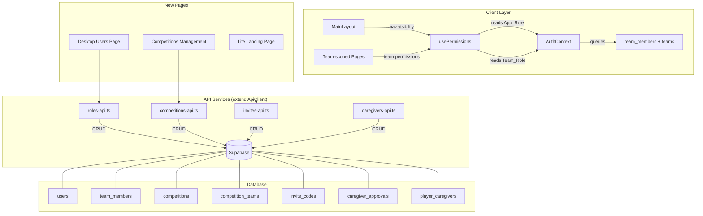

# Design Document: User Role Management

## Overview

This feature overhauls the West Coast Rangers app's role and membership system. The core changes are:

1. **Deprecate `user_teams`** — AuthContext switches to `team_members` as the single source of truth for team assignments, fixing the current bug where authenticated users see no teams.
2. **Dual role system** — `users.role` (App_Role) controls navigation/app-level permissions; `team_members.role` (Team_Role) controls team-level actions. These are independent: a user can be a coach app-wide but a player on a specific team.
3. **Competitions framework** — `competitions` and `competition_teams` tables track WCR vs Other competitions with date-based status and manual close workflow.
4. **Lite user workflows** — Three scenarios (non-WCR competition invite, mid-season WCR player, caregiver addition) each create `user_type = 'lite'` accounts via invite codes and a Lite Landing Page.
5. **Caregiver approval** — Adding a caregiver to a player requires existing caregiver approval (7-day timeout → admin escalation).
6. **Invite delivery** — MVP uses in-app messaging for manual share; production adds SMS + email + deep links.
7. **Privacy consent** — Lite Landing Page collects explicit consent before registration.

The design touches AuthContext, usePermissions, the desktop Users page, new API services, new pages (competitions management, lite landing), and a single migration file (036).

## Architecture



### Key Architectural Decisions

**Decision 1: Single migration file (036)**
All schema changes go into one migration. This keeps the feature atomic and rollback-friendly. The migration adds the `manager` value to `team_members.role`, adds `user_type` to `users`, and creates all new tables.

**Decision 2: App_Role drives navigation, Team_Role drives team actions**
`usePermissions` continues to use `user.role` (App_Role) for `hasFullVersion`/`hasLiteVersion`. A new `useTeamPermissions(teamId)` hook (or extension of `usePermissions`) checks the user's `team_members.role` for the selected team context. This means a coach (App_Role) who is a player (Team_Role) on Team X sees full nav but can't manage Team X's roster.

**Decision 3: Invite codes are team-scoped, optionally competition-scoped**
Each invite code links to a `team_id` and optionally a `competition_id`. This supports all three lite scenarios with a single `invite_codes` table. Expiry defaults to 21 days.

**Decision 4: Caregiver approval is async with timeout**
The `caregiver_approvals` table tracks pending/approved/denied/escalated status. A scheduled check (or on-access check) escalates to admin after 7 days of no response.

**Decision 5: MVP invite delivery via in-app messaging**
No external SMS/email integration for the prototype. The invite code and shareable link are delivered to the initiating coach/manager via the existing messaging system, who then forwards manually.

## Components and Interfaces

### Modified Components

#### AuthContext (`src/contexts/AuthContext.tsx`)

Current `fetchUserProfile` queries `user_teams`. This changes to:

```typescript
// BEFORE (broken — user_teams is empty)
const { data: userTeams } = await supabase
  .from('user_teams')
  .select('*, team:teams(*)')
  .eq('user_id', userId);

// AFTER
const { data: teamMemberships } = await supabase
  .from('team_members')
  .select('*, team:teams(*)')
  .eq('user_id', userId);
```

The `UserProfile` type gains a `teamMemberships` field containing `TeamMember & { team: Team }` objects, each including the `role` (Team_Role). The legacy `teams` field is replaced.

#### usePermissions (`src/hooks/usePermissions.ts`)

Stays the same for app-level checks. Gains a new function:

```typescript
const getTeamRole = (teamId: string): 'coach' | 'manager' | 'player' | null => {
  const membership = user?.teamMemberships?.find(tm => tm.team_id === teamId);
  return membership?.role ?? null;
};

const canManageTeamRoster = (teamId: string): boolean => {
  if (isAdmin) return true;
  const role = getTeamRole(teamId);
  return role === 'coach' || role === 'manager';
};
```

#### Desktop Users Page

Adds a team assignment management section per user:
- List of current assignments (team name + Team_Role)
- Add assignment: team dropdown + role dropdown → inserts into `team_members`
- Change role: inline role dropdown → updates `team_members.role`
- Remove assignment: delete button → removes from `team_members`
- Duplicate prevention: UI disables teams already assigned

### New API Services

#### `src/lib/roles-api.ts`

```typescript
class RolesApi extends ApiClient {
  // Team membership CRUD
  getTeamMembers(teamId: string): Promise<TeamMemberWithUser[]>
  getUserTeamMemberships(userId: string): Promise<TeamMemberWithTeam[]>
  addTeamMember(teamId: string, userId: string, role: TeamRole): Promise<TeamMember>
  updateTeamMemberRole(membershipId: string, role: TeamRole): Promise<TeamMember>
  removeTeamMember(membershipId: string): Promise<void>
  
  // User type management
  promoteToFullUser(userId: string): Promise<User>
  getLiteUsersReport(teamId?: string): Promise<LiteUserReport[]>
}
```

#### `src/lib/competitions-api.ts`

```typescript
class CompetitionsApi extends ApiClient {
  getCompetitions(): Promise<Competition[]>
  getCompetition(id: string): Promise<Competition>
  createCompetition(data: CreateCompetitionPayload): Promise<Competition>
  updateCompetition(id: string, data: Partial<Competition>): Promise<Competition>
  deleteCompetition(id: string): Promise<void>
  closeCompetition(id: string): Promise<void>  // sets end_date to today, status to 'closed'
  
  // Team links
  getCompetitionTeams(competitionId: string): Promise<CompetitionTeam[]>
  linkTeam(competitionId: string, teamId: string): Promise<CompetitionTeam>
  unlinkTeam(competitionId: string, teamId: string): Promise<void>
  
  // Lite cleanup
  cleanupLiteUsers(competitionId: string): Promise<{ removed: number; retained: number }>
}
```

#### `src/lib/invites-api.ts`

```typescript
class InvitesApi extends ApiClient {
  generateInviteCode(teamId: string, competitionId?: string): Promise<InviteCode>
  validateInviteCode(code: string): Promise<InviteCodeValidation>
  redeemInviteCode(code: string, userData: LiteRegistrationData): Promise<User>
  getPendingInvites(): Promise<InviteCode[]>
  
  // Mid-season player
  inviteMidSeasonPlayer(teamId: string, playerData: InvitePlayerData): Promise<InviteCode>
}
```

#### `src/lib/caregivers-api.ts`

```typescript
class CaregiversApi extends ApiClient {
  // Caregiver-player links
  getPlayerCaregivers(playerId: string): Promise<PlayerCaregiver[]>
  getCaregiverPlayers(caregiverId: string): Promise<PlayerCaregiver[]>
  linkCaregiverToPlayer(caregiverId: string, playerId: string): Promise<PlayerCaregiver>
  unlinkCaregiverFromPlayer(caregiverId: string, playerId: string): Promise<void>
  
  // Approval workflow
  requestCaregiverAddition(playerId: string, caregiverData: NewCaregiverData): Promise<CaregiverApproval>
  respondToApproval(approvalId: string, approved: boolean): Promise<CaregiverApproval>
  getMyPendingApprovals(): Promise<CaregiverApproval[]>
  escalateTimedOutApprovals(): Promise<CaregiverApproval[]>  // called on access or scheduled
}
```

### New Pages

#### Competitions Management (`src/pages/desktop/CompetitionsPage.tsx`)

Desktop admin page with:
- Table of competitions (name, type, status, dates, team count)
- Create/edit form (name, type, start_date, end_date)
- Team linking interface (add/remove teams)
- "Close Now" action button
- Lite user cleanup action for closed Other competitions

#### Lite Landing Page (`src/pages/LiteLandingPage.tsx`)

Public page (no auth required) accessed via invite link with code parameter:
- Validates invite code on load
- Shows error states: expired code (with notification to inviter), already redeemed, invalid
- Registration form: first name, last name, email, password
- Privacy consent checkbox with notice text
- On submit: creates lite user, redeems code, adds to team

#### Caregiver Approval Page (`src/pages/CaregiverApprovalPage.tsx`)

In-app page for existing caregivers:
- Shows pending approval requests for their linked players
- Approve/deny buttons per request
- Shows new caregiver name and requesting coach/manager


## Data Models

### Modified Tables

#### `users` — add `user_type` column

```sql
ALTER TABLE public.users
  ADD COLUMN user_type text NOT NULL DEFAULT 'full'
  CHECK (user_type IN ('full', 'lite'));
```

Existing users get `'full'` via the default. New lite users are explicitly set to `'lite'`.

#### `team_members` — add `'manager'` to role constraint

```sql
ALTER TABLE public.team_members
  DROP CONSTRAINT IF EXISTS team_members_role_check;

ALTER TABLE public.team_members
  ADD CONSTRAINT team_members_role_check
  CHECK (role IN ('player', 'coach', 'manager'));
```

### New Tables

#### `competitions`

| Column | Type | Constraints |
|--------|------|-------------|
| id | uuid | PK, default gen_random_uuid() |
| name | text | NOT NULL |
| competition_type | text | CHECK ('wcr', 'other'), NOT NULL |
| status | text | CHECK ('active', 'closed'), DEFAULT 'active' |
| start_date | date | NOT NULL |
| end_date | date | NOT NULL |
| created_at | timestamptz | DEFAULT now() |
| updated_at | timestamptz | DEFAULT now() |

#### `competition_teams`

| Column | Type | Constraints |
|--------|------|-------------|
| id | uuid | PK, default gen_random_uuid() |
| competition_id | uuid | FK → competitions, ON DELETE CASCADE |
| team_id | uuid | FK → teams, ON DELETE CASCADE |
| created_at | timestamptz | DEFAULT now() |
| | | UNIQUE(competition_id, team_id) |

#### `invite_codes`

| Column | Type | Constraints |
|--------|------|-------------|
| id | uuid | PK, default gen_random_uuid() |
| code | text | UNIQUE, NOT NULL |
| team_id | uuid | FK → teams, ON DELETE CASCADE |
| competition_id | uuid | FK → competitions (nullable) |
| created_by | uuid | FK → users |
| recipient_email | text | NOT NULL |
| recipient_phone | text | nullable |
| redeemed_by | uuid | FK → users (nullable) |
| redeemed_at | timestamptz | nullable |
| expires_at | timestamptz | NOT NULL |
| created_at | timestamptz | DEFAULT now() |

Default `expires_at` = `created_at + interval '21 days'`.

#### `caregiver_approvals`

| Column | Type | Constraints |
|--------|------|-------------|
| id | uuid | PK, default gen_random_uuid() |
| player_id | uuid | FK → users, NOT NULL |
| new_caregiver_email | text | NOT NULL |
| new_caregiver_first_name | text | NOT NULL |
| new_caregiver_last_name | text | NOT NULL |
| requested_by | uuid | FK → users, NOT NULL |
| status | text | CHECK ('pending', 'approved', 'denied', 'escalated'), DEFAULT 'pending' |
| responded_by | uuid | FK → users (nullable) |
| responded_at | timestamptz | nullable |
| created_at | timestamptz | DEFAULT now() |

#### `player_caregivers`

| Column | Type | Constraints |
|--------|------|-------------|
| id | uuid | PK, default gen_random_uuid() |
| player_id | uuid | FK → users, ON DELETE CASCADE |
| caregiver_id | uuid | FK → users, ON DELETE CASCADE |
| created_at | timestamptz | DEFAULT now() |
| | | UNIQUE(player_id, caregiver_id) |

### New TypeScript Interfaces

```typescript
// Team role type (expanded)
export type TeamRole = 'player' | 'coach' | 'manager';

// User type
export type UserType = 'full' | 'lite';

// Competition
export interface Competition {
  id: string;
  name: string;
  competition_type: 'wcr' | 'other';
  status: 'active' | 'closed';
  start_date: string;
  end_date: string;
  created_at: string;
  updated_at: string;
}

// Competition-Team link
export interface CompetitionTeam {
  id: string;
  competition_id: string;
  team_id: string;
  created_at: string;
}

// Invite code
export interface InviteCode {
  id: string;
  code: string;
  team_id: string;
  competition_id: string | null;
  created_by: string;
  recipient_email: string;
  recipient_phone: string | null;
  redeemed_by: string | null;
  redeemed_at: string | null;
  expires_at: string;
  created_at: string;
}

// Caregiver approval
export interface CaregiverApproval {
  id: string;
  player_id: string;
  new_caregiver_email: string;
  new_caregiver_first_name: string;
  new_caregiver_last_name: string;
  requested_by: string;
  status: 'pending' | 'approved' | 'denied' | 'escalated';
  responded_by: string | null;
  responded_at: string | null;
  created_at: string;
}

// Updated User interface (adds user_type)
export interface User {
  id: string;
  email: string;
  first_name: string;
  last_name: string;
  cellphone: string;
  role: UserRole;       // App_Role
  user_type: UserType;  // 'full' | 'lite'
  active: boolean;
  created_at: string;
  last_login?: string;
  privacy_consent_at?: string;
}

// Updated TeamMember (adds 'manager')
export interface TeamMember {
  id: string;
  team_id: string;
  user_id: string;
  role: TeamRole;  // 'player' | 'coach' | 'manager'
  created_at: string;
  updated_at: string;
}

// Updated UserProfile (uses team_members instead of user_teams)
export interface UserProfile extends User {
  teamMemberships: (TeamMember & { team: Team })[];
  defaultTeam?: Team;
}
```

### RLS Policies (New Tables)

All new tables have RLS enabled. Policy pattern:
- **SELECT**: Authenticated users can read (consistent with existing tables)
- **INSERT/UPDATE/DELETE**: Restricted to admins, or to coaches/managers for their own teams (checked via `team_members` join)

For `invite_codes`: coaches/managers can create codes for teams they manage. Admins can manage all.
For `caregiver_approvals`: the requesting user and linked caregivers can read. Linked caregivers can update status. Admins can update status (for escalation).
For `player_caregivers`: caregivers can read their own links. Admins can manage all.


## Correctness Properties

*A property is a characteristic or behavior that should hold true across all valid executions of a system — essentially, a formal statement about what the system should do. Properties serve as the bridge between human-readable specifications and machine-verifiable correctness guarantees.*

### Property 1: Profile loading includes all team memberships with roles

*For any* user who has entries in `team_members`, loading their profile via AuthContext should return a `teamMemberships` array containing every `team_members` record for that user, each including the correct `team_id`, `role` (Team_Role), and joined `team` object.

**Validates: Requirements 1.1, 1.3**

### Property 2: Role value validation

*For any* `users.role` value, it must be one of: `admin`, `coach`, `manager`, `player`, `caregiver`. *For any* `team_members.role` value, it must be one of: `coach`, `manager`, `player`. Any attempt to insert or update with a value outside these sets must be rejected.

**Validates: Requirements 2.1, 2.2, 9.4**

### Property 3: App_Role and Team_Role independence

*For any* user and *for any* combination of App_Role and Team_Role values, the system shall accept a team membership assignment regardless of the user's App_Role. A single user may hold different Team_Roles on different teams simultaneously.

**Validates: Requirements 2.3, 2.4, 11.5**

### Property 4: Navigation variant determined by App_Role

*For any* user with App_Role in `{admin, coach, manager}`, the `hasFullVersion` permission check returns `true` and `hasLiteVersion` returns `false`. *For any* user with App_Role in `{player, caregiver}`, `hasLiteVersion` returns `true` and `hasFullVersion` returns `false`.

**Validates: Requirements 2.6, 11.1, 11.2**

### Property 5: Team-level permissions determined by Team_Role

*For any* user and *for any* team they belong to, team-level permission checks (e.g., `canManageTeamRoster`, `canCreateEvents`) shall depend solely on the user's Team_Role for that specific team, not on their App_Role. When the team context changes, permissions re-evaluate using the new team's Team_Role.

**Validates: Requirements 2.7, 11.3, 11.4**

### Property 6: Team roster display includes Team_Role

*For any* team roster query, every returned member record shall include the member's Team_Role for that specific team.

**Validates: Requirements 2.5, 3.1**

### Property 7: Team assignment uniqueness

*For any* user and team, there shall be at most one record in `team_members`. Attempting to insert a duplicate `(team_id, user_id)` pair shall be rejected.

**Validates: Requirements 3.6**

### Property 8: Default Team_Role is 'player'

*For any* team member addition where no Team_Role is explicitly specified (e.g., coach/manager adding a player to their roster), the system shall default the Team_Role to `'player'`.

**Validates: Requirements 3.7, 9.1**

### Property 9: Competition date-based status

*For any* competition, if the current date is before `start_date` or after `end_date`, the competition shall be treated as closed. If the current date is within `[start_date, end_date]` and `status` is `'active'`, the competition shall be treated as active.

**Validates: Requirements 4.10**

### Property 10: Competition creation validation

*For any* competition creation attempt, the system shall reject it if `name`, `competition_type`, `start_date`, or `end_date` is missing.

**Validates: Requirements 4.2, 4.4**

### Property 11: User type matches creation pathway

*For any* user created through the standard admin flow, `user_type` shall be `'full'`. *For any* user created through a lite invite process (non-WCR competition, mid-season player, or caregiver addition), `user_type` shall be `'lite'` and the appropriate App_Role shall be set (`'player'` for scenarios 1 and 2, `'caregiver'` for scenario 3).

**Validates: Requirements 5.2, 5.3, 6.5, 7.3**

### Property 12: Lite user added to team with 'player' role

*For any* lite user created via an invite code for a team, the system shall create a `team_members` record linking that user to the invite's team with Team_Role `'player'`.

**Validates: Requirements 6.6, 7.4**

### Property 13: Competition cleanup preserves promoted users

*For any* closed Other competition, running the lite user cleanup shall deactivate and remove team memberships only for users whose `user_type` is still `'lite'`. Users who were promoted to `'full'` during the competition shall retain their accounts and all team memberships.

**Validates: Requirements 6.8, 6.9, 4.12**

### Property 14: Invite code validation rejects redeemed and expired codes

*For any* invite code that has been redeemed (`redeemed_by` is not null), attempting to use it shall fail with a "code already redeemed" error. *For any* invite code where `expires_at` is in the past, attempting to use it shall fail with an "expired" error.

**Validates: Requirements 6.10, 6.11**

### Property 15: Invite code default expiry is 21 days

*For any* generated invite code, `expires_at` shall equal `created_at + 21 days`.

**Validates: Requirements 6.12**

### Property 16: Existing user skip on invite

*For any* invite where the recipient email matches an existing user in the system, the system shall not create a new user account. Instead, it shall add the existing user to the team in `team_members` with the appropriate Team_Role.

**Validates: Requirements 6.13, 7.6**

### Property 17: Lite-to-full promotion preserves memberships

*For any* lite user promotion to full, the user's `user_type` shall change to `'full'` and all existing `team_members` records for that user shall remain unchanged.

**Validates: Requirements 7.9**

### Property 18: Coach/manager permission to add team members

*For any* user attempting to add a member to a team, the operation shall succeed only if the requesting user has Team_Role of `'coach'` or `'manager'` on that team, or has App_Role of `'admin'`.

**Validates: Requirements 7.1, 8.1, 9.3**

### Property 19: Caregiver approval request creation

*For any* player with one or more existing caregivers, initiating a new caregiver addition shall create a `caregiver_approvals` record with status `'pending'`, and the record shall contain the new caregiver's first name, last name, and email.

**Validates: Requirements 8.3, 8.4**

### Property 20: Caregiver approval triggers account creation

*For any* caregiver approval request, when any existing caregiver sets the status to `'approved'`, the system shall create a user record with `user_type = 'lite'` and `App_Role = 'caregiver'`.

**Validates: Requirements 8.5**

### Property 21: Caregiver registration creates player link

*For any* new caregiver who completes registration via the Lite Landing Page for a specific player, a `player_caregivers` record shall exist linking that caregiver to that player.

**Validates: Requirements 8.7**

### Property 22: Caregiver approval denial notification

*For any* caregiver approval request where all existing caregivers have responded with `'denied'`, the request status shall be `'denied'`.

**Validates: Requirements 8.8**

### Property 23: Caregiver approval timeout escalation

*For any* caregiver approval request with status `'pending'` where `created_at` is more than 7 days ago and no caregiver has responded, the status shall be escalated to `'escalated'`.

**Validates: Requirements 8.9**

### Property 24: Skip approval for players with no caregivers

*For any* player with zero entries in `player_caregivers`, initiating a caregiver addition shall skip the approval process and proceed directly to creating the caregiver account and sending the invitation.

**Validates: Requirements 8.10**

### Property 25: Caregiver read access to player's team data

*For any* caregiver linked to a player via `player_caregivers`, the caregiver shall have read access to the player's team schedule, messages, and events.

**Validates: Requirements 10.5**

### Property 26: Invite code stores recipient contact info

*For any* generated invite code, the `invite_codes` record shall contain a non-null `recipient_email` and the `recipient_phone` if provided.

**Validates: Requirements 13.1, 13.4**

### Property 27: Privacy consent required and stored

*For any* registration attempt via the Lite Landing Page without consent acknowledgement, the registration shall be rejected. *For any* successful lite registration, the user record shall contain a non-null `privacy_consent_at` timestamp.

**Validates: Requirements 14.4, 14.5**

### Property 28: Existing caregivers visible to new caregiver

*For any* caregiver newly linked to a player who has other existing caregivers, the system shall return the names of those existing caregivers when queried.

**Validates: Requirements 14.6**

## Error Handling

### Invite Code Errors

| Error Condition | Handling |
|----------------|----------|
| Invalid/unknown code | Display "Invalid invite code" on Lite Landing Page |
| Expired code | Display expiry message, notify the inviter via in-app message |
| Already redeemed code | Display "This code has already been used" |
| Email already registered (full user) | Skip account creation, add to team, show success |
| Email already registered (lite user on same team) | Display "You're already a member of this team" |

### Caregiver Approval Errors

| Error Condition | Handling |
|----------------|----------|
| All caregivers deny | Set status to 'denied', notify requesting coach/manager |
| 7-day timeout with no response | Set status to 'escalated', notify admin |
| Player has no caregivers | Skip approval, proceed directly |
| Duplicate caregiver-player link | Reject with "This caregiver is already linked to this player" |

### Team Assignment Errors

| Error Condition | Handling |
|----------------|----------|
| Duplicate (team_id, user_id) | Reject with "User is already assigned to this team" |
| Invalid Team_Role value | Reject with validation error |
| Non-admin/coach/manager attempting to add | Reject with "Insufficient permissions" |

### Competition Errors

| Error Condition | Handling |
|----------------|----------|
| Missing required fields | Reject with field-specific validation errors |
| end_date before start_date | Reject with "End date must be after start date" |
| Closing already-closed competition | No-op, return current state |
| Cleanup on WCR competition | Reject — cleanup only applies to Other competitions |

## Testing Strategy

### Dual Testing Approach

This feature uses both unit tests and property-based tests for comprehensive coverage.

**Property-Based Testing Library**: [fast-check](https://github.com/dubzzz/fast-check) for TypeScript

**Configuration**: Each property test runs a minimum of 100 iterations.

### Property-Based Tests

Each correctness property above maps to a single property-based test. Tests are tagged with:

```
// Feature: user-role-management, Property {N}: {property title}
```

Key property tests:

1. **Profile loading** (Property 1): Generate random users with random team_members entries. Load profile. Assert all memberships present with correct roles.
2. **Role validation** (Property 2): Generate random strings. Assert only valid role values are accepted by the validation functions.
3. **Independence** (Property 3): Generate random (App_Role, Team_Role) pairs. Assert all combinations are accepted.
4. **Navigation** (Property 4): Generate random App_Roles. Assert correct nav variant.
5. **Team permissions** (Property 5): Generate random users with different Team_Roles on different teams. Assert permissions match Team_Role per team.
6. **Uniqueness** (Property 7): Generate random (user, team) pairs. Assert second insert fails.
7. **Default role** (Property 8): Generate random team member additions without explicit role. Assert role is 'player'.
8. **Competition status** (Property 9): Generate random competitions with random dates. Assert status matches date logic.
9. **User type pathway** (Property 11): Generate random creation events via different pathways. Assert user_type matches pathway.
10. **Cleanup preservation** (Property 13): Generate random competitions with mixed lite/full users. Run cleanup. Assert only lite users removed.
11. **Invite validation** (Property 14): Generate random invite codes with various states. Assert correct validation outcome.
12. **Expiry default** (Property 15): Generate random invite codes. Assert expires_at = created_at + 21 days.
13. **Existing user skip** (Property 16): Generate random invites where email matches existing user. Assert no new user created.
14. **Promotion preservation** (Property 17): Generate random lite users with team memberships. Promote. Assert memberships unchanged.
15. **Approval escalation** (Property 23): Generate random approvals with various ages. Assert escalation after 7 days.
16. **Consent** (Property 27): Generate random registration attempts with/without consent. Assert rejection without consent, timestamp stored with consent.

### Unit Tests

Unit tests cover specific examples, edge cases, and integration points:

- AuthContext loads empty array when user has no team memberships
- "Close Now" sets end_date to today and status to 'closed'
- Invite code generation produces unique alphanumeric codes
- Caregiver approval with single existing caregiver (approve and deny paths)
- Admin can always manage any team regardless of Team_Role
- Privacy notice text contains required disclosures
- Lite Landing Page renders registration form for valid code
- Lite Landing Page renders error for invalid/expired/redeemed code
- Competition team linking and unlinking
- User type filter on admin Users page

### Test File Organization

```
src/__tests__/
  roles-api.test.ts           — unit + property tests for roles API
  competitions-api.test.ts    — unit + property tests for competitions API
  invites-api.test.ts         — unit + property tests for invite code logic
  caregivers-api.test.ts      — unit + property tests for caregiver workflows
  usePermissions.test.ts      — unit + property tests for permission logic
  AuthContext.test.ts          — unit tests for profile loading
```
